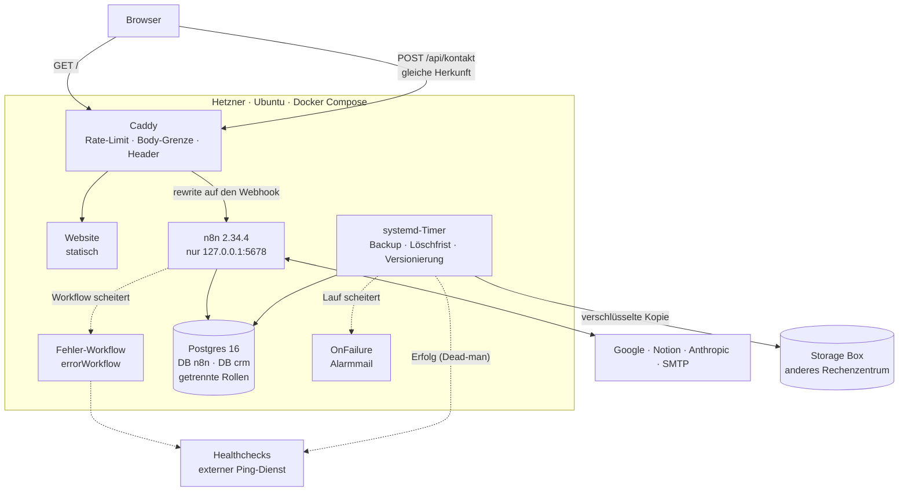

# n8n im Eigenbetrieb: Workflows und Server

**Röhrner Automation**: Automatisierung für Handwerksbetriebe und KMU. Dieses Repository zeigt beides, die n8n-Workflows mit
echten Use Cases und den Server, auf dem sie laufen: Reverse Proxy, Container-Stack, Datenbank, Backup, Löschfristen und
Alarmweg. Jeder Workflow-Export kommt direkt aus der laufenden Instanz, jede Betriebsdatei vom Server, beides ist um
Zugangsdaten bereinigt. Wo ein Workflow abgeschaltet ist, steht es dabei. Was nicht gemessen ist, steht ebenfalls dabei.

**Elias Röhrner** · Aldersbach, Niederbayern · [roehrner.eu](https://roehrner.eu) · kontakt@roehrner.eu

## Überblick

Ein Hetzner-Server, alles in Docker Compose, kein Dienst direkt auf dem Host.

- **Caddy** ist der einzige Eingang. Er läuft mit einem selbst gebauten Rate-Limit-Plugin, einer Body-Grenze und
  Security-Headern. Das Kontaktformular der Website spricht **nur mit `roehrner.eu`** (gleiche Herkunft, kein CORS). Caddy
  reicht den Pfad an n8n weiter, und die Drossel greift, bevor überhaupt eine Ausführung startet.
- **n8n** ist nur an `127.0.0.1:5678` gebunden und wird ausschließlich über Caddy erreicht; die Oberfläche liegt zusätzlich
  hinter Basic Auth.
- **Postgres 16** hält zwei getrennte Datenbanken mit getrennten Rollen: `n8n` für die Instanz, `crm` für Anfragen und
  Kundendaten. Die Rolle, mit der n8n auf die Anfragen zugreift, darf nur lesen und einfügen; das Aufräumen nach Ablauf der
  Frist läuft mit eigenen Rechten.
- **n8n ist auf 2.34.4 festgesetzt** (`n8nio/n8n:2.34.4`), aus zwei Gründen. Erstens behandelt diese Version Fehlerausgänge je
  Node-Typ unterschiedlich; das ist für genau diese Version gemessen (siehe [Wie ich arbeite](#wie-ich-arbeite)), und ein
  Update verlangt die Messung neu. Zweitens liest die tägliche Workflow-Versionierung die n8n-Tabellen mit einer namentlichen
  Spaltenliste; ein Update, das eine Spalte ändert, würde sonst still ein unvollständiges Abbild versionieren.
- **Alarmweg:** Scheitert ein Workflow, schreibt der hinterlegte Fehler-Workflow (`errorWorkflow`) einen Eintrag ins
  Fehler-Log und meldet an Healthchecks. Scheitert ein Serverjob (Backup, Löschfrist, Versionierung), schickt systemd über
  `OnFailure` eine Mail mit den letzten Journalzeilen. Läuft ein Job gar nicht, schweigt er nicht still: Das Backup meldet
  jeden Erfolg nach außen, bleibt die Meldung aus, kommt der Alarm (Dead-man-Switch). Der Alarmweg selbst testet sich
  wöchentlich. Eine Sammelmeldung je Lauf ist für den Mahnlauf geplant und noch nicht gebaut.
- **Backup** nächtlich: `pg_dumpall` beider Datenbanken, n8n-Volume und Konfiguration, AES-256, Kopie auf eine Storage Box in
  einem anderen Rechenzentrum über einen eigenen Sub-Account. Der Restore ist vollständig geprobt, auch von der Storage Box.
- **Löschfristen**, technisch erzwungen: Server-Logs 7 Tage, n8n-Ausführungen 7 Tage, Kontaktanfragen 6 Monate, Backups 14
  Tage.



Mehr zum Aufbau und warum das Formular nicht über die n8n-Subdomain läuft: [`docs/architektur.md`](docs/architektur.md).

## Workflows

| Workflow | Use Case | Konnektoren | Status |
|---|---|---|---|
| [Kontaktformular](workflows/kontaktformular/) | Anfragen von der Website annehmen, serverseitig prüfen, benachrichtigen, dem Absender antworten, speichern — und alarmieren, wenn einer dieser Schritte scheitert | Webhook, SMTP, Postgres, HTTP (Überwachung) | **aktiv** seit 18.08.2026, getestet mit n8n 2.34.4 |
| [Eingangsrechnungen](workflows/eingangsrechnungen/) | PDF-Rechnungen aus dem Postfach auslesen, benennen, in Drive ablegen, in Notion erfassen — und alles liegen lassen, was nicht sicher erkannt ist | Gmail, Google Drive, Anthropic, Notion | nicht aktiv; lief auf n8n 2.34.4 |
| [Posteingang](workflows/posteingang/) | Geschäftspostfach nach festen Regeln und, wo keine greift, per Modell einordnen; labeln, nur bei Sicherheit archivieren, nie löschen | Gmail, Anthropic, Notion | nicht aktiv; lief auf n8n 2.34.4 |
| [Tagesliste](workflows/tagesliste/) | Aus einem Notion-Backlog eine Tagesauswahl treffen lassen, mit Fallback und Filter gegen erfundene IDs | Webhook, Notion, Anthropic | nicht aktiv seit 30.08.2026 |
| Mahnlauf | Offene Rechnungen gegen den Kontoauszug abgleichen und stufenweise nachfassen; Mahnungen erst nach Freigabe | Google Sheets, Google Drive, Gmail | in Arbeit |
| Wartungserinnerung | Kunden rechtzeitig an fällige Wartungen erinnern | — | in Arbeit |
| Bewertungsantworten | Antwortentwürfe auf Online-Bewertungen, Versand erst nach Freigabe | — | in Arbeit |
| Baustellenmappe | Fotos, Notizen und Unterlagen je Baustelle an einem Ort bündeln | — | in Arbeit |

Jeder Workflow-Ordner enthält den Export zum Import (`workflow.json`; besteht ein Workflow aus mehreren Teilen, eine Datei je
Teil mit Importreihenfolge) und ein README mit Problem, Ablauf, Konnektoren, Einrichtung, Grenzen und Status.

Ausführlich: **[Case-Study Kontaktformular](docs/case-study-kontaktformular.md)**. Sie beschreibt die eine Pipeline von der
Formulareingabe bis zur Löschfrist, einschließlich der Stellen, an denen ich zuerst danebenlag.

## Betrieb

Alles, was die Workflows trägt, liegt unter [`betrieb/`](betrieb/). Ausführlich beschrieben in
[`betrieb/ops/README.md`](betrieb/ops/README.md).

| Bereich | Was läuft | Dateien |
|---|---|---|
| Reverse Proxy | Caddy mit Rate-Limit-Plugin, Body-Grenze, Security-Header, Same-Origin-Proxy fürs Kontaktformular | [`betrieb/infra/Caddyfile`](betrieb/infra/Caddyfile), [`betrieb/infra/caddy-build/`](betrieb/infra/caddy-build/) |
| Container-Stack | n8n, Postgres und Caddy per Compose, Healthcheck-Abhängigkeit, n8n nur an localhost gebunden | [`betrieb/infra/docker-compose.yml`](betrieb/infra/docker-compose.yml) |
| Backup | nächtlicher systemd-Timer, AES-256, Kopie auf die Storage Box über einen eigenen Sub-Account | [`betrieb/ops/roehrner-backup.sh`](betrieb/ops/roehrner-backup.sh) |
| Löschfristen | Kontaktanfragen nach sechs Monaten, dazu Log- und Ausführungsfristen in der Konfiguration | [`betrieb/ops/roehrner-loeschfrist.sh`](betrieb/ops/roehrner-loeschfrist.sh), [`betrieb/infra/`](betrieb/infra/) |
| Alarmweg | `OnFailure`-Mail mit Journalzeilen; Sofortmeldung und wöchentlicher Selbsttest über einen externen Ping-Dienst | [`betrieb/ops/README.md`](betrieb/ops/README.md#alarmweg) |
| Dead-man-Switch | Das Backup meldet jeden erfolgreichen Lauf; bleibt die Meldung aus, kommt der Alarm | [`betrieb/ops/README.md`](betrieb/ops/README.md#dead-man-switch) |
| Workflow-Versionierung | täglich eine lesende Abfrage an Postgres, je Workflow eine Datei in einem lokalen git ohne Remote | [`betrieb/ops/roehrner-workflow-export.sh`](betrieb/ops/roehrner-workflow-export.sh) |
| Serverzugang | nur SSH-Schlüssel, `ufw` mit 22/80/443, `fail2ban` | [`betrieb/ops/README.md`](betrieb/ops/README.md#zugang-zum-server) |

**Drei Entscheidungen, die den Unterschied machen:**

- **Die Drossel sitzt vor n8n, nicht darin.** Ein Zähler im Code-Node hält parallelen Anfragen nicht stand: n8n schreibt
  `staticData` erst am Ende einer Ausführung zurück, parallele Anfragen lesen denselben Stand. Deshalb begrenzt Caddy (drei
  Anfragen je IP in zehn Minuten, 60 je Stunde für den Pfad). Der Code-Node bleibt als zweite Linie.
- **Gemessen statt angenommen.** Am 17.08.2026 habe ich die Härtung gegen den Live-Server geprüft statt gegen meine
  Konfigurationsdatei: Über die n8n-Subdomain war der Webhook an allen Grenzen vorbei erreichbar, 200 KB Nutzlast gingen
  durch. Die Messwerte stehen als Kommentar im [Caddyfile](betrieb/infra/Caddyfile).
- **Ein Fehler in der Datenbank hält die Benachrichtigung nicht auf.** Im Kontaktformular laufen Speichern und
  Benachrichtigen parallel. Klemmt Postgres, kommt die Anfrage trotzdem per Mail.

**Was gemessen wurde**, jeweils an einem echten Lauf:

- **Restore** vollständig durchgespielt, null Fehler, Hash des Encryption Keys danach identisch; Restore von der Storage Box
  separat geprobt.
- **Fehlerfall des Backups:** Mit verfälschtem Zielhost bricht der Dienst mit Exit-Code 1 ab, statt still durchzulaufen.
- **Kontotrennung auf der Storage Box**, belegt durch den Entzug: Die Box weist den Server-Schlüssel ab, der Backup-Lauf geht
  weiter über den Sub-Account.
- **Alarmweg** mit echten Fehlern, ohne die Produktivkonfiguration anzufassen.
- **Workflow-Versionierung:** Anlegen, Ändern, Archivieren und Löschen eines Test-Workflows erzeugen je genau einen Commit;
  ein Lauf ohne Änderung erzeugt keinen.
- **Drossel gegen gefälschte Absender-IPs:** [`betrieb/ops/smoke-test.sh`](betrieb/ops/smoke-test.sh).

**Stand der Dateien:** `betrieb/infra/` und `betrieb/ops/` zeigen den Stand, den ich zuletzt vom Server übernommen habe. Am
Server sind seitdem zwei Dinge dazugekommen, die hier noch fehlen (gemessen am 24.09.2026): Speicher- und Prozessgrenzen je
Container (n8n 1,5 GiB, Postgres 768 MiB, Caddy 256 MiB) und eine JSON-Antwort des Kontaktpfads, wenn die Drossel greift
(429). Sie kommen mit dem nächsten Abgleich über
[`betrieb/tools/server-artefakte-holen.sh`](betrieb/tools/server-artefakte-holen.sh).

## Wie ich arbeite

Claude ist bei mir kein Beiwerk, sondern die Art, wie ich baue: **Claude Code** für Server- und Frontend-Arbeit, **MCP** für
Werkzeugzugriff aus dem Modell heraus, die **Anthropic-API** direkt in n8n.

- **Messen statt annehmen.** Der Ist-Zustand kommt vom Server und aus der laufenden Instanz, nie aus der eigenen Doku.
- **Ein Nachweis je Änderung.** Jede Korrektur endet mit einer Messung, die ohne die Änderung fehlgeschlagen wäre. Ein
  Alarm, der nie ausgelöst wurde, gilt als Vermutung. Deshalb werden Fehlerfälle echt erzwungen, an einer Kopie des
  Workflows.
- **Korrektheitsbedingungen je Node-Typ.** In n8n 2.34.4 meldet ein Lauf mit `onError: continueErrorOutput` immer
  `success`, und der Fehler-Workflow feuert nicht. Ob das Fehler-Item auf dem Fehlerausgang landet, hängt vom Node-Typ und
  seiner Version ab. Gemessen am 24.09.2026: **`postgres` 2.5 und `emailSend` 2.1 bedienen den Fehlerausgang,
  `httpRequest` 4.5 nicht**; dort liegt das Item auf dem regulären Ausgang, und ein Alarm am Fehlerausgang läuft nie. Jeder
  andere Typ wird vor Verwendung gemessen. Die Herleitung steht in der
  [Case-Study](docs/case-study-kontaktformular.md#9--der-fehlerausgang-bekommt-eine-stimme).
- **Dem Modell wird nicht geglaubt, sondern geprüft.** Unbrauchbares JSON fällt auf eine feste Regel zurück, zurückgegebene
  IDs werden gegen die tatsächlich vorhandenen gefiltert, und wo das Modell unsicher ist, passiert nichts.
- **Regeln aus Fehlern.** Aus jedem Fehlschlag wird eine Arbeitsregel, die das Modell als Kontext mitbekommt.

Ein Modell beschleunigt das Bauen, aber es ersetzt die Abnahme nicht.

## Was hier nicht steht

- **Vier Workflows, einer davon produktiv.** Drei sind abgeschaltet und stehen als Arbeitsproben hier, weil ihre Bauweise
  unabhängig davon trägt, ob sie gerade laufen. Das ist kein Betrieb mit Dutzenden Workflows.
- **Die Workflows der Digitalen Auftragsannahme** (Telefon, Transkription, SMS-Dialog) laufen auf derselben Instanz, stehen
  aber nicht hier. Sie verarbeiten echte Anrufe und Personendaten.
- **Die Betriebsdateien hinken dem Server hinterher**, siehe [Stand der Dateien](#betrieb). Was am Server läuft, entscheidet
  der Server, nicht dieses Repository.
- **Ein Webhook war anfangs offen.** Die Tagesliste nahm Anfragen ohne Authentifizierung an, und über den Request-Body ließ
  sich ein Modellaufruf erzwingen. Aufgefallen ist das erst beim Veröffentlichen hier. Der Webhook bekam eine Header-Prüfung,
  am 30.08.2026 wurde der Workflow abgeschaltet.
- **Zugangsdaten, Server-Adresse, Ping-URLs und Webhook-Pfade** sind entfernt oder durch Platzhalter ersetzt; ein Import
  läuft deshalb nicht ohne eigene Credentials.
- **Python** setze ich für Skripte und Datenaufbereitung ein, nicht für produktive Services.
- **Offene Punkte** stehen je Workflow unter „Grenzen“ und in der
  [Case-Study](docs/case-study-kontaktformular.md#10--was-offen-ist). Ein Portfolio ohne offene Punkte ist entweder gelogen
  oder unbenutzt.

## Aufbau des Repositorys

```
workflows/<name>/   Export (bereinigt) und README je Workflow
betrieb/infra/      Caddyfile, docker-compose.yml, .env.example, Dockerfile für Caddy mit Rate-Limit
betrieb/ops/        Backup, Löschfrist, Alarmweg und Workflow-Versionierung: Skripte und systemd-Units
                    smoke-test.sh — Nachweis der Drossel gegen gefälschte Absender-IPs
betrieb/tools/      n8n-status.py — welche Workflows laufen, wann zuletzt, mit welchem Ergebnis
                    n8n-fehler.py — fehlgeschlagene Ausführungen mit Node und Meldung
                    server-artefakte-holen.sh — Betriebsdateien vom Server holen, durch den Sanitizer
docs/               Architektur, Case-Study Kontaktformular
tools/              n8n-export.py / n8n-export.sh — Ist-Stand der Workflows über die Public API ziehen
                    sanitize.py — macht Exporte veröffentlichungsfähig
                    tests/fixtures/ — Testkorpus mit ausschließlich erfundenen Werten
```

Die Bereinigung ist selbst versioniert: [`tools/sanitize.py`](tools/sanitize.py) ersetzt Credential-IDs, Server-IPs (IPv4 und
IPv6), Notion-IDs, Google-IDs (Drive-Ordner, Dateien, Tabellen), Webhook-IDs **und Webhook-Pfade** (der Pfad kann selbst das
Geheimnis sein), lokale Pfade, Tokens und API-Keys, Werte hinter Schlüsselnamen wie `password` oder `apiKey`, Passwörter in
Connection-Strings, Überwachungs-URLs und Impressumsangaben aus Mailsignaturen, und wirft n8n-interne Laufzeitfelder weg. Danach
prüft ein breiter gefasster Mustersatz das Ergebnis; bleibt ein Verdacht, wird nichts geschrieben (fail-closed). Dieselbe
Bereinigung läuft über die Betriebsdateien, die `betrieb/tools/server-artefakte-holen.sh` vom Server holt.

## Export aktualisieren

```bash
# alle Workflows der Instanz, je nach workflows/<name>/workflow.json
python3 tools/n8n-export.py https://n8n.example.eu
# einen Workflow an eine feste Stelle
python3 tools/n8n-export.py https://n8n.example.eu --id <workflow-id> --ziel workflows/kontaktformular/workflow.json
# Betriebsdateien vom Server
./betrieb/tools/server-artefakte-holen.sh <benutzer>@<SERVER_IP>
```

Die Werkzeuge fragen Zugangsdaten verdeckt ab oder nehmen sie aus `N8N_API_KEY`, `N8N_UI_USER` und `N8N_UI_PASS`. Die
ungereinigte Rohfassung liegt nur während des Laufs in einem temporären Verzeichnis. `tools/n8n-export.sh` ist die ältere
Shell-Fassung und schreibt noch flach nach `workflows/<name>.json`.

Import in n8n: *Workflows → Import from File*, danach die Credentials neu zuordnen — die IDs sind absichtlich entfernt.

## Lizenz

MIT — siehe [LICENSE](LICENSE).
