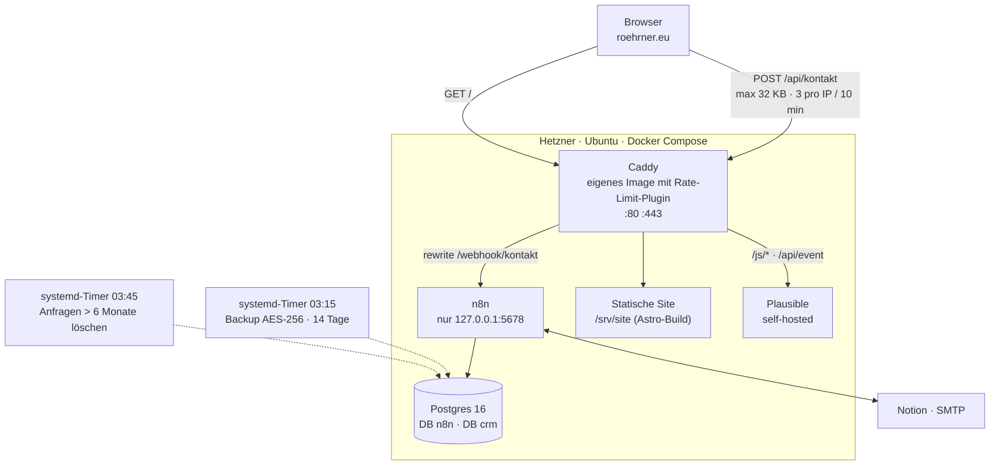

# Architektur

Ein Hetzner-Server, alles in Docker Compose, kein Dienst direkt auf dem Host.
`systemctl status caddy` ist deshalb irreführend — dort gibt es keinen
Caddy-Dienst.

## Warum das Formular über `roehrner.eu` läuft und nicht über die n8n-Subdomain

Drei Gründe, in dieser Reihenfolge:

1. **Gleiche Herkunft.** Der Browser spricht ausschließlich mit `roehrner.eu`.
   CORS entfällt vollständig, und es gibt keine Preflight-Anfrage, die schiefgehen
   kann.
2. **Die Grenzen greifen wirklich.** Wären beide Wege offen, ließe sich die
   Drossel auf `/api/kontakt` einfach über die Subdomain umgehen — genau das war
   am 17.08.2026 der Fall, siehe
   [Case-Study](case-study-kontaktformular.md#3--der-befund-der-die-härtung-wertlos-gemacht-hätte).
3. **Die Subdomain war bei Safe Browsing gelistet.** Sie kommt im Kundenpfad
   nicht mehr vor, damit ist eine Listung für Besucher folgenlos.

## Trennung der Datenbanken

`n8n` und `crm` liegen in derselben Postgres-Instanz, aber in getrennten
Datenbanken mit getrennten Rollen. Die Rolle, mit der n8n auf die Kundenanfragen
zugreift, darf ausschließlich lesen und einfügen — kein `DELETE`, kein
Schema-Zugriff. Das Aufräumen nach Ablauf der Frist erledigt ein Cron-Job mit
eigenen Rechten.
