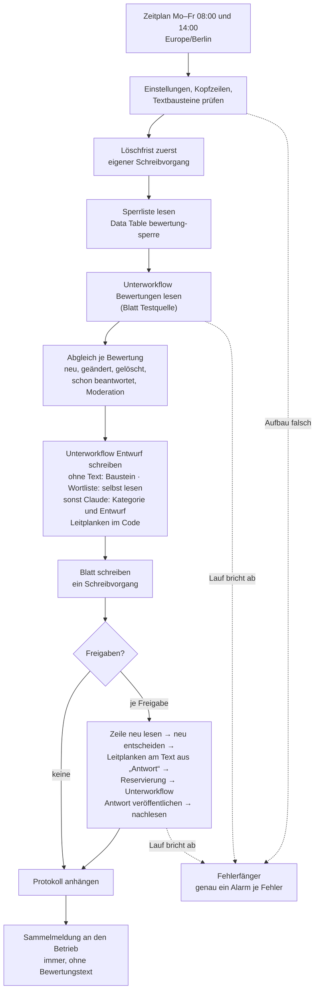

# Bewertungsantworten

**Status:** nicht aktiv · fünf Workflows, 69 Nodes (dazu 21 im eingebetteten Unterlauf) · **getestet mit n8n 2.34.4** am 27. und
28.09.2026 (Modus `trocken`, dann Testkatalog B01–B34 im Modus `test` in Veröffentlichungsfenstern) · **Quelle und Ziel sind in
dieser Fassung ein nachgebautes Google-Profil** (Blatt „Testquelle“); der Weg zu Google ist vorbereitet, nicht gebaut · **Modus
`scharf` gibt es in dieser Fassung nicht**, siehe [Modi](#modi-trocken-test-scharf). Alle Daten in diesem Ordner sind erfunden:
Betrieb „Zimmerei & Dachbau Beispiel GmbH“, Bewertungen `R-9NNN`, Anzeigenamen „Bewerter Probe NN“.

## Problem und für wen

Online-Bewertungen entscheiden mit, wen ein Kunde anruft. Wer jede Bewertung beantwortet, wirkt ansprechbar; wer eine kritische
unbeantwortet lässt, überlässt dem Bewerter das letzte Wort. Kleinen Betrieben fehlt dafür die Zeit, und eine schnell
geschriebene Antwort kann mehr Schaden anrichten als keine: Schon der Satz „Sie waren doch gar nicht bei uns“ oder ein Detail aus
dem Auftrag veröffentlicht Daten über eine erkennbare Person.

Die Bewertungsantworten lesen neue Bewertungen ein, lassen Claude einen **Antwortentwurf** schreiben und legen ihn in einer
Google-Tabelle vor. **Veröffentlicht wird nur nach Freigabe im Blatt und nach den Leitplanken im Code:** nur der Text, der bei
der Freigabe in der Spalte „Antwort“ steht, unmittelbar vorher neu gelesen und noch einmal geprüft. Der Betrieb kann den Entwurf
übernehmen, ändern, ablehnen oder selbst antworten.

**Für wen sie sich lohnt:** Handwerksbetriebe mit laufendem Bewertungsaufkommen auf Google (einige bis einige Dutzend im Monat),
die jede Bewertung beantworten wollen, dafür keine Zeit finden, die Antwort aber selbst lesen und verantworten.

**Für wen nicht:** Betriebe mit einer Handvoll Bewertungen im Jahr (die beantwortet man von Hand), Betriebe, die Antworten nicht
selbst lesen wollen — ohne Freigabe geht nichts hinaus, das ist der Zweck —, und Betriebe, deren Bewertungen vor allem auf anderen
Plattformen liegen.

## Ablauf



**Die fünf Workflows:**

| Datei | Workflow | Aufgabe |
|---|---|---|
| `workflows/1-fehlerfaenger.json` | Bewertungsantworten – Fehlerfänger | `errorWorkflow` der anderen vier; Alarm per SMTP an die Meldeadresse |
| `workflows/2-bewertungen-lesen.json` | Bewertungsantworten – Bewertungen lesen | Quelle lesen, Statusmeldung statt Wurf bei Erwartbarem |
| `workflows/3-entwurf-schreiben.json` | Bewertungsantworten – Entwurf schreiben | Wortliste, Maskierung, Claude, Schema und Leitplanken |
| `workflows/4-antwort-veroeffentlichen.json` | Bewertungsantworten – Antwort veröffentlichen | Zieladapter: neu lesen, nur bei unveränderter Bewertung ohne Antwort schreiben, nachlesen |
| `workflows/5-hauptlauf.json` | Bewertungsantworten – Hauptlauf | Zeitplan, Löschfrist, Abgleich, Blatt, Freigaben, Protokoll, Sammelmeldung |

Das Veröffentlichen je Freigabe steckt im Hauptlauf als eingebetteter Unterlauf („Freigabe veröffentlichen“, Quelle *Define
Below*, 21 Nodes). Er reserviert, ruft den Zieladapter und trägt das Ergebnis ein. So bleibt „Antwort veröffentlichen“ ein
reiner Adapter mit festem Vertrag, und der Weg zu Google ist später ein Tausch an einer Stelle.

Die Logik steckt nicht in Ausdrücken, sondern in sechzehn JavaScript-Modulen unter [`kern/`](kern/). Die Code-Nodes tragen genau
diese Bytes (vor der Marke `// ==== Treiber, nicht Teil des Kerns …`), die Tests unter [`tests/`](tests/) prüfen dieselben
Dateien. **Eine Ausnahme:** In den Nodes „Eingang prüfen“ und „Abschliessen“ von „Entwurf schreiben“ hat der Bereiniger des
Repositorys ein erfundenes Straßenbeispiel in einem Kommentar aus `maskierung.js` als Anschrift erkannt und ersetzt; der Code
selbst ist gleich. Blöcke, die aus der [Wartungserinnerung](../wartungserinnerung/) stammen, tragen einen Herkunftsvermerk und
sind byte-gleich übernommen.

## Die KI entwirft, der Betrieb gibt frei

- **Claude schreibt nur einen Entwurf.** Er landet in den Spalten „Entwurf“ und „Antwort“ des Blatts. Veröffentlicht wird
  ausschließlich, was nach der Freigabe des Betriebs in „Antwort“ steht, und erst, nachdem der Code diesen Text unmittelbar vor
  dem Schreiben neu gelesen und durch die Leitplanken geschickt hat. Kein Pfad führt von der Anthropic-Antwort ohne Freigabe zum
  Ziel.
- **Strukturierte Ausgabe** über Structured Outputs (`output_config.format`, JSON-Schema): `kategorie` (`positiv`, `neutral`,
  `kritisch`, `unfair`, `heikel`), `sicher`, `gruende` (feste Werte wie `rechtsdrohung`, `verletzung_schaden`,
  `keine_kundenbeziehung`, `anweisung_im_text`), `entwurf`. Eine Antwort außerhalb des Schemas, ein HTTP-Fehler oder ein anderer
  `stop_reason` als `end_turn` zählt als „keine Einordnung“: `selbst lesen`, Alarm in der Sammelmeldung.
- **Feste Modell-ID** `claude-sonnet-4-5-20250929`, nicht ein Alias. Gewählt nach einem Vergleich an vierzehn erfundenen
  Bewertungen, je Modell dreimal: Beide Modelle hatten keinen harten Treffer im Entwurf, aber bei den heiklen und unfairen Fällen
  ordnete Sonnet 15 von 15 richtig ein, `claude-haiku-4-5-20251001` 12 von 15, und nur Haiku folgte einer in der Bewertung
  versteckten Anweisung. Ein Wechsel ist eine Änderung an einer Stelle (`KI_MODELL` in `kern/entwurf.js`) mit neuem Testlauf.
- **Kosten:** gemessen je Entwurf 1 139 bis 1 780 Token Eingabe und 34 bis 218 Token Ausgabe, zu 3 $ / 15 $ je Million Token
  **rund 0,53 US-Cent**; über den ganzen Testkatalog 39 Anfragen für 21,15 US-Cent (0,54 je Anfrage). Bei 30 Bewertungen im
  Monat rund 2 US-Dollar im Jahr.
- **Was Claude bekommt:** Sterne, den **maskierten und gekürzten** Bewertungstext (Telefon, Mail, IBAN, Anschrift, Postleitzahl
  mit Ort, der Anzeigename und das Wort nach „Herr“ oder „Frau“ als Platzhalter; höchstens 2 000 Zeichen), dazu Betriebsname,
  Signatur und Kontaktweg. **Keine Bewertungs-ID, kein Anzeigename, keine Kunden- oder Auftragsdaten** — was die KI nicht hat,
  kann sie nicht in einen Entwurf schreiben.
- **Ohne KI:** Sterne ohne Text bekommen einen festen Baustein je Sternzahl, ohne Anthropic-Aufruf. Trifft die Wortliste
  „heikel“ (Anwalt, Klage, Polizei, verletzt, Datenschutz und ähnliche, dazu Anweisungen an die KI wie „ignoriere“ oder
  „Kategorie“), geht die Bewertung gar nicht an Claude: `selbst lesen`, Aufgabe an den Betrieb.
- **Kategorie statt Entwurf:** Ordnet Claude eine Bewertung als `unfair` ein (etwa eine Beleidigung ohne Inhalt), wird der
  Entwurf der feste Baustein „unfair“, dazu der Hinweis „Meldung an Google prüfen“. Bei `heikel` gibt es keinen Entwurf, nur
  `selbst lesen`.

## Sicherungen

Jede Sicherung steht im Kern an einer markierten Stelle (`// Sicherung …`). 139 davon wurden einzeln verändert (Mutation); jede
machte mindestens einen Test rot.

- **Nur mit Freigabe.** Nur `freigeben` oder `freigeben trotz Hinweis` in der Spalte „Freigabe“; jeder andere Wert ergibt einen
  Hinweis, die Zelle bleibt stehen, es wird nichts geschrieben. Die Freigabe über das Blatt ist die konkrete, ausdrückliche
  Zustimmung je Antwort — deshalb gibt es keinen Modus ohne Freigabe.
- **Unmittelbar vorher neu gelesen.** Vor jeder Veröffentlichung liest der Hauptlauf die Zeile neu und entscheidet neu; der
  Zieladapter liest die Bewertung noch einmal und schreibt nur, wenn ihr Stand unverändert ist und sie noch keine Antwort hat.
  **Eine vorhandene Antwort wird nie überschrieben.** Eine geänderte Bewertung lässt die Freigabe verfallen und bekommt einen
  neuen Entwurf.
- **Harte Leitplanken blockieren immer**, auch bei „freigeben trotz Hinweis“: Mailadresse, Telefonnummer oder URL, die nicht
  wörtlich in Kontaktweg oder Signatur steht (URL nur zur eigenen Domain); IBAN; der Anzeigename und Namen nach „Herr“/„Frau“ aus
  der Bewertung; ungefüllte Platzhalter; zusätzliche verbotene Begriffe des Betriebs; mehr als die Höchstlänge (Standard 800
  Zeichen) oder 4 096 Byte; **jede Aussage zur Kundenbeziehung**, bestätigend oder bestreitend („Ihr Auftrag“, „kein Kunde“, „nie
  bei uns“).
- **Weiche Leitplanken verlangen „freigeben trotz Hinweis“:** Beträge, Daten und Uhrzeiten, Orte und Straßen, Vorgangswörter
  („Rechnung“, „Angebot“, „Baustelle“, ein bestimmter Termin, „bei Ihnen“), eine **angedeutete** Kundenbeziehung („Sie mit unserer
  Arbeit zufrieden“, „bei Ihnen vor Ort“, „Ihr Vertrauen“, „bei uns … aufgehoben“), eine Antwort, die nicht deutsch ist.
- **Die Leitplanken laufen zweimal:** am Entwurf (mit hartem Treffer wird „Antwort“ nicht vorbelegt) und am endgültigen Text aus
  „Antwort“, den der Betrieb vielleicht geändert hat, unmittelbar vor dem Veröffentlichen.
- **Grenzen der Heuristik.** Die Muster finden Formen, keine Bedeutungen. Gemessen am Kern:
  - „wir melden uns bei Ihnen“ trifft **weich** (Vorgangswort „bei Ihnen“), obwohl der Satz harmlos ist;
  - ein **Vorname ohne Anrede** („Klaus freut sich über Ihr Lob“) trifft **nicht** — keine Liste erkennt einen Namen, der nicht
    als Anzeigename oder hinter „Herr“/„Frau“ steht;
  - „bei uns gut aufgehoben“ trifft **weich** als angedeutete Kundenbeziehung (seit einer Verschärfung nach den ersten Messungen).

  **Die Prüfung ersetzt das Lesen nicht, sie fängt die häufigsten Fehler.**
- **Beobachtung aus dem Testkatalog:** Der Prompt verbietet, sich zur Kundenbeziehung zu äußern oder zu schreiben, dass die
  Person mit der Arbeit zufrieden war, und nennt als Beispiel „Über Ihre Rückmeldung freuen wir uns.“ Trotzdem trugen **7 von 33 KI-Entwürfen** den weichen Hinweis „Kundenbeziehung
  angedeutet“. Der Prompt senkt die Rate, die Leitplanke fängt den Rest; ohne „freigeben trotz Hinweis“ geht keiner davon hinaus.
- **Bewertungstext ist Fremdtext.** Er steht im Prompt als Daten, und die Ausgabe wird unabhängig von der KI geprüft (Schema,
  Leitplanken, Wortliste). Schlimmster Fall ist ein schlechter Entwurf, der ohne Freigabe nie hinausgeht.
- **Sperre gegen Doppelveröffentlichung** (wie in Mahnlauf und Wartungserinnerung): Reservierung in einer n8n Data Table
  (`bewertung-sperre`, legt der Hauptlauf selbst an; nur Schlüssel, Aktion, Lauf, Hash — kein Text, kein Name). Je Fassung einer
  Bewertung höchstens eine Veröffentlichung; die früheste Reservierung schreibt, `veroeffentlicht` gewinnt. Die Reservierung
  eines abgebrochenen Laufs wird nie blind wiederholt: Zeigt die Quelle eine Antwort mit gleichem Hash, wird nachgezogen, sonst
  wird die Zeile `Versandstatus unklar`, mit Alarm.
- **Mengenbremse:** mehr Freigaben als „Höchstzahl Veröffentlichungen je Lauf“ (Standard 10) → keine, Alarm; höchstens 20
  Entwürfe je Lauf, älteste zuerst; mindestens 7 Sekunden zwischen zwei Veröffentlichungen.
- **Genau ein Alarm je Fehler.** Scheitert ein Unterworkflow, meldet er selbst; der Fehlerfänger erkennt an der Laufnummer im
  Fehler des Aufrufers, dass schon gemeldet wurde, und schweigt. **Läuft der Zieladapter gar nicht an** (etwa weil er nicht
  veröffentlicht ist), alarmiert der Hauptlauf genau einmal, und die Freigabe wird `Versandstatus unklar`.
- **Fail-closed beim Tabellenaufbau:** fehlt ein Blatt oder eine Spalte, ist ein Textbaustein ungültig oder eine Einstellung
  außerhalb ihres Bereichs, bricht der Lauf vor jedem Schreiben ab und alarmiert.
- **Datensparsamkeit:** Bewertungstext, Entwurf und Antwort stehen nur im Blatt „Bewertungen“ — nicht in der Data Table, nicht
  im Protokoll, nicht in der Sammelmeldung. Gemessen im Testkatalog mit einem eindeutigen Satz und einem Anzeigenamen: beide an
  keinem dieser Orte, Name und Bewertungs-ID in keiner Anfrage an Anthropic; derselbe Suchlauf fand den Satz in der Testquelle
  (Kontrolle).
- **Löschfrist ≤ 30 Tage.** „Löschfrist in Tagen“ ist 1 bis 30 (Standard 30), sonst bricht der Lauf ab. Gezählt ab dem Stand
  der Bewertung, nicht ab dem Einlesen; gelöscht wird im letzten planmäßigen Lauf **vor** Fristablauf (Freitag 14:00 statt
  Montag 08:00), als eigener Schreibvorgang vor allem anderen, damit ein späterer Fehler sie nicht aufhält. Bewertungstext,
  Entwurf und Antwort werden geleert, Status `Frist abgelaufen`. Erfolgreiche Läufe speichern ihre Daten nicht (Einrichtung,
  Schritt 11); Fehlerläufe behalten sie bis zur Aufbewahrungsfrist der Instanz, die deshalb unter 30 Tagen liegen muss.

## Rechtlicher Arbeitsstand — keine Rechtsberatung

Arbeitsstand, nicht anwaltlich geprüft. Vor dem Einsatz beim Kunden gehört er mit einer Rechtsberatung geklärt.

- **DSGVO — schon die Bestätigung, dass jemand Kunde war, ist heikel.** Die Antwort ist öffentlich und bezieht sich auf eine
  erkennbare Person. Beispiel: Österreich, BVwG 05.02.2025, W291 2298821-1 — ein Facharzt legte in seiner Antwort auf eine
  Google-Rezension die Diagnose der Patientin offen; bestätigt wurde ein Verstoß gegen Art. 9 Abs. 1 und Art. 5 Abs. 1 DSGVO
  (Geldbuße 3.000 €). Übertragen: keine Auftragsdetails, Beträge, Orte, Termine oder Namen, die Kundenbeziehung weder bestätigen
  noch bestreiten — umgesetzt als Leitplanken, also als Heuristik.
- **Google-Richtlinien der Business Profile APIs:** Antworten im Auftrag eines Betriebs nur mit dessen vorheriger Autorisierung;
  keine automatisierten Antworten ohne „prior specific and express consent“ — die Freigabe je Zeile ist diese Zustimmung. Inhalte
  aus der API höchstens 30 Kalendertage speichern → Löschfrist ≤ 30. Offen: ob das Blatt und der Anthropic-Aufruf noch als Nutzung
  innerhalb des Business-Profile-Projekts gelten.
- **KI-Verordnung Art. 50 Abs. 4:** Die Kennzeichnungspflicht für veröffentlichten KI-Text greift nach diesem Arbeitsstand nicht:
  Eine Bewertungsantwort informiert nicht über Angelegenheiten von öffentlichem Interesse, und selbst dann deckt die Ausnahme für
  menschliche Überprüfung sie — jeder Text wird vom Betrieb gelesen, ist änderbar, geht nur mit seiner Freigabe hinaus, und er
  veröffentlicht unter seinem Namen.
- **Auftragsverarbeitung, zwei Fälle.** An Anthropic geht nur der maskierte, gekürzte Bewertungstext; Bewertungen, Entwürfe und
  Antworten liegen in Google Sheets. Das Maskieren ist eine Heuristik und kann versagen.
  - *Betrieb durch Röhrner Automation* (n8n, Anthropic-Konto und Google Workspace von Röhrner Automation): Der Betrieb schließt
    einen Auftragsverarbeitungsvertrag nach Art. 28 DSGVO mit Röhrner Automation; Anthropic und Google sind
    Unterauftragsverarbeiter. Der Auftragsverarbeitungsvertrag (DPA) von Anthropic samt Standardvertragsklauseln ist Bestandteil
    der Commercial Terms, das Cloud Data Processing Addendum von Google Bestandteil des Workspace-Vertrags.
  - *Eigenbetrieb durch den Betrieb* (eigene n8n-Instanz, eigene Konten): Der DPA kommt mit den eigenen Commercial Terms bzw. dem
    eigenen Workspace-Vertrag; die Drittlandübermittlung (Art. 44 ff. DSGVO) prüft der Betrieb selbst. **Ein privates Google-Konto
    hat keinen solchen Datenschutzzusatz — Eigenbetrieb also nur mit Google Workspace.**
  - In beiden Fällen ergänzt der Betrieb seine Datenschutzhinweise um die Bewertungsantworten und den Entwurf mit KI.
  - Stand der Prüfung 27.09.2026; Arbeitsstand, keine Rechtsberatung. Ob die Business Profile APIs unter das Cloud Data
  Processing Addendum fallen, ist nicht geprüft (Google-Weg, siehe [Grenzen](#grenzen-und-ausblick)).
- **UWG, nur eingeordnet:** öffentliche geschäftliche Kommunikation, keine Werbemail an eine Person; Aussagen in der Antwort sind
  geschäftliche Handlungen (§ 5 UWG, Irreführung), nicht weiter geprüft.
- **Art. 22 DSGVO:** keine automatische Entscheidung mit Wirkung für den Bewerter; die KI liefert nur einen Entwurf.

## Modi: trocken, test, scharf

| Modus | Veröffentlichen | Sammelmeldung und Alarm | Blatt und Data Table |
|---|---|---|---|
| `trocken` (Vorlage) | nie; die Sammelmeldung listet, was veröffentlicht worden wäre, Betreff mit „[TROCKEN – nichts veröffentlicht]“ | an die Meldeadresse | Blatt „Bewertungen“ und Protokoll werden geschrieben; keine Data Table |
| `test` | in das Blatt „Testquelle“ (nachgebautes Google-Profil); der „Stichtag (nur Test)“ ersetzt „heute“ | an die Meldeadresse | wie vorgesehen, mit Data Table |
| `scharf` | **in dieser Fassung nicht gebaut** | — | — |

**Schattenbetrieb:** Vor jedem echten Einsatz läuft der Workflow einige Wochen im Modus `trocken` beim Betrieb mit; jede
Sammelmeldung zeigt, was veröffentlicht worden wäre.

**Modus `scharf` gibt es in dieser Fassung nicht.** „Prüfen“ im Hauptlauf meldet ihn als „Modus scharf gesperrt (Portfolio,
Version 1)“, und die Treiber der Code-Nodes werfen bei jedem anderen Modus als `trocken` und `test`. Anders als in Mahnlauf und
Wartungserinnerung genügt es nicht, eine Zeile zu entfernen: `scharf` braucht den Weg zu Google (Quelle und Zieladapter), der
fehlt. Quelle `google` endet heute mit dem Status `quelle_nicht_gebaut`, Ziel `google` mit `ziel_nicht_gebaut`.

## Einrichtung

1. **n8n 2.34.4.** Die Fehlerausgänge sind für genau diese Version gemessen; eine andere Version verlangt die Messung neu.
   Data Tables müssen verfügbar sein (in 2.34.4 Standard).
2. **Credentials** anlegen: Google Sheets OAuth2 (das Konto, dem die Tabelle gehört), Anthropic (API-Schlüssel) und SMTP (für
   Sammelmeldung und Alarm).
3. **Tabelle:** [`vorlage/bewertungsantworten-vorlage.xlsx`](vorlage/bewertungsantworten-vorlage.xlsx) in Google Sheets
   importieren, Zeitzone „Europe/Berlin“ und Gebietsschema Deutschland einstellen. Blätter und Spaltennamen nicht ändern — der
   Workflow prüft sie.
4. **Einstellungen** ausfüllen (Blatt „Einstellungen“, Spalte B): Meldeadresse, Absenderadresse (die des SMTP-Kontos),
   Betriebsname, Signatur, Kontaktweg (ein Satz, den jede Antwort bei Kritik enthält; Nummer, Mail oder Link darin sind in
   Antworten erlaubt), eigene Domain, „Bewertungen ab“. Modus `trocken` und Quelle `test` stehen schon; Höchstzahlen, Höchstlänge
   800 und Löschfrist 30 Tage stehen auf bewährten Werten.
5. **Textbausteine** prüfen: je Art genau eine Zeile (`ohne Text 1` bis `ohne Text 5`, `unfair`); Platzhalter `{betrieb}`,
   `{signatur}`, `{kontaktweg}`.
6. **Testquelle:** In dieser Fassung ist das Blatt „Testquelle“ die Quelle — je Bewertung eine Zeile in der Form der Google-API
   (`reviewId`, `starRating` `ONE`–`FIVE`, `comment`, `createTime`, `updateTime` als Zeitpunkt UTC, …).
7. **Importieren in dieser Reihenfolge:** `1-fehlerfaenger`, `2-bewertungen-lesen`, `3-entwurf-schreiben`,
   `4-antwort-veroeffentlichen`, `5-hauptlauf`. Je Datei einen neuen Workflow anlegen, oben rechts *⋯ → Import from file…*; der
   Name kommt aus der Datei, gespeichert wird selbsttätig. Erst zum nächsten Workflow wechseln, wenn gespeichert ist.
8. **Credentials in den Knoten zuordnen.** Der Import setzt nur SMTP („Alarm senden“, „Sammelmeldung“); die übrigen 13 Knoten
   einmal öffnen (gibt es für den Typ genau eine Credential, setzt n8n sie selbst) oder im Feld wählen:
   - Fehlerfänger: „Einstellungen lesen“ (Sheets)
   - Bewertungen lesen: „Tabelle lesen“, „Werte lesen“ (Sheets)
   - Entwurf schreiben: „Claude fragen“ (Anthropic)
   - Antwort veröffentlichen: „Tabelle lesen“, „Werte lesen“, „Antwort schreiben“, „Nachlesen“ (Sheets)
   - Hauptlauf: „Blätter lesen“, „Werte lesen“, „Löschfrist schreiben“, „Blatt schreiben“, „Protokoll anhängen“ (Sheets)
9. **Eingebetteter Unterlauf „Freigabe veröffentlichen“ im Hauptlauf.** Seine Knoten stehen als JSON im Feld „Workflow JSON“,
   dort ordnet n8n keine Credential zu. Den Knoten öffnen, in das Feld klicken und mit Cmd+F bzw. Strg+F suchen und ersetzen:
   - `<CREDENTIAL_ID>` (drei Stellen, *replace all*) durch die ID der Google-Sheets-Credential — zu finden unter *Credentials →*
     die Credential öffnen *→ Details → ID*;
   - `NJ0fnhHw67HHRK1M` (eine Stelle, der Zieladapter meiner Instanz) durch die ID des importierten Workflows „Bewertungsantworten
     – Antwort veröffentlichen“ — sie steht in dessen Adresse (`/workflow/<ID>`).

   Ohne diesen Schritt endet die erste Freigabe mit „Credential with ID "<CREDENTIAL_ID>" does not exist for type
   "googleSheetsOAuth2Api".“
10. **Tabellen-ID** an **zwei** Stellen eintragen, wo `<GOOGLE_ID>` steht: im Code-Node „Lauf vorbereiten“ des Hauptlaufs und im
    Code-Node „Einstellungen vorbereiten“ des Fehlerfängers (im Code-Editor mit Cmd+F bzw. Strg+F suchen und ersetzen).
11. **Einstellungen der Workflows.** Der Import übernimmt sie nicht. In allen fünf unter *⋯ → Settings* „Timezone“ auf
    „Europe/Berlin“ — eine frische Instanz steht auf „America/New York“, und nach ihr richtet sich der Zeitplan. In den Workflows
    2 bis 5 zusätzlich „Save successful production executions“ auf „Do not save“ — ihre Laufdaten enthalten Bewertungstexte. Mit
    *Save* speichern.
12. **Fehlerfänger veröffentlichen** (*Publish*; der vorgeschlagene Versionsname genügt), danach in den Workflows 2 bis 5 unter
    *Settings → Error Workflow* „Bewertungsantworten – Fehlerfänger“ wählen. Vorher ist er dort ausgegraut: n8n 2.34.4 bietet nur
    einen veröffentlichten Fehler-Workflow an und startet auch nur einen solchen.
13. **Unterworkflows verweisen.** Die Knoten „Bewertungen lesen“ und „Entwurf schreiben“ im Hauptlauf tragen noch die
    Workflow-IDs meiner Instanz; der Editor zeigt dafür keine Warnung. Je Knoten bei *Workflow* von „By ID“ auf „From list“
    umstellen und den importierten Workflow wählen.
14. **Veröffentlichen:** „Bewertungen lesen“, „Entwurf schreiben“ und „Antwort veröffentlichen“, zuletzt den Hauptlauf — ab dann
    läuft sein Zeitplan (Mo–Fr 08:00 und 14:00). Ein nicht veröffentlichter Unterworkflow wird nicht gestartet („Workflow is not
    active and cannot be executed.“).
15. **Schattenbetrieb** im Modus `trocken`, dann `test` gegen die Testquelle; `scharf` gibt es in dieser Fassung nicht (siehe
    [Modi](#modi-trocken-test-scharf)).

Gemessen am 28.09.2026 auf einer leeren n8n 2.34.4: alle fünf nach den Schritten 1, 2 und 7 bis 14 importiert, eingerichtet und
veröffentlicht, ohne Fehlermeldung; jeder Code-Node nach dem Import gleich der Datei, Einstellungen und Verweise danach wie
beschrieben. Probeaufrufe aus zusätzlichen Workflows erreichten „Bewertungen lesen“ (Quelle `google` → `quelle_nicht_gebaut`), den
Zieladapter über den Verweis im eingebetteten Unterlauf (Ziel `google` → `ziel_nicht_gebaut`) und „Entwurf schreiben“, dessen Fehler
den Fehlerfänger startete; die erfolgreichen Unterläufe wurden nicht gespeichert (Schritt 11). Der eingebettete Unterlauf endete
vor Schritt 9 mit der Meldung oben, danach am ersten Google-Aufruf. Ohne verbundenes Google-Konto endet jeder Lauf dort („Unable to
sign without access token“); die Schritte 3 bis 6 sind deshalb auf dieser Instanz nicht gemessen.

**Optional: Healthchecks.** Die Sammelmeldung kommt nach jedem Lauf — aber wenn gar keiner läuft (Instanz aus, Workflow
inaktiv), meldet niemand etwas, und die Löschfrist wartet bis zum nächsten Lauf. Wer das absichern will, hängt ans Ende des
Hauptlaufs einen `httpRequest` auf eine Healthchecks-Ping-URL (Never Error). Nicht Teil von Version 1.

## Im Betrieb

- **Freigeben:** Entwurf lesen, in „Antwort“ bei Bedarf ändern, in „Freigabe“ `freigeben` wählen — oder `freigeben trotz
  Hinweis`, wenn nur weiche Hinweise stehen. `ablehnen` setzt den Status `abgelehnt`, `selbst beantwortet` vermerkt eine Antwort
  von Hand; beides veröffentlicht nichts.
  Der nächste Lauf veröffentlicht, trägt „veröffentlicht am“ ein und leert „Freigabe“.
- **Status nach dem Veröffentlichen:** `wartet auf Google`, solange die Antwort in Prüfung ist (der nächste Lauf liest nach);
  `veröffentlicht`; `von Google abgelehnt` mit dem Grund aus der Moderation als Aufgabe — der Workflow versucht es nicht erneut,
  der Betrieb antwortet dann von Hand.
- **Aufgaben** stehen in der Sammelmeldung mit Sternen, Kategorie, Zeile und Link aufs Blatt — nie mit Bewertungstext, Entwurf
  oder Name: `selbst lesen` (Wortliste, heikel, KI-Fehler), „Meldung an Google prüfen“ (unfair), „Meldung an Google oder Anwalt
  prüfen“ (Rechtsdrohung, Verletzung, Daten Dritter).
- **Bewertung geändert:** Freigabe verfällt, neuer Entwurf; hat der Betrieb „Antwort“ schon geändert, bleibt sein Text mit dem
  Hinweis „Bewertung geändert – eigene Antwort prüfen“.
- **„Versandstatus unklar“** entsteht, wenn ein Lauf mitten im Veröffentlichen abbrach oder der Zieladapter nicht anlief. Der
  Workflow veröffentlicht dann nie von selbst noch einmal. Der Betrieb sieht im Profil nach und trägt in „Versandstatus klären“
  `veröffentlicht` oder `nicht veröffentlicht` ein; der nächste Lauf zieht nach bzw. gibt die Reservierung frei und entscheidet
  neu. Ein Wert ohne offene Reservierung ändert nichts und wird gemeldet.

## Was sie nicht tut

Sie veröffentlicht nichts ohne Freigabe und ersetzt oder löscht keine vorhandene Antwort. Sie meldet keine Bewertung und lässt
keine löschen, bittet niemanden um eine Bewertung und schickt dem Bewerter keine Nachricht — es gibt nur die interne
Sammelmeldung an den Betrieb. Sie liest in dieser Fassung keine echten Google-Bewertungen und keine anderen Plattformen
(ProvenExpert, MyHammer). Sie berät nicht rechtlich.

## Gemessen, nicht angenommen

Jeder dieser Punkte hat den Bau verändert. Gemessen auf n8n 2.34.4 an einer Kopie der Workflows, mit Laufnummern in meinen
Arbeitsbelegen.

- **Ein nicht veröffentlichter Unterworkflow startet nicht:** „Workflow is not active and cannot be executed.“ kommt auf dem
  Fehlerausgang des Aufrufers an — und der Unterworkflow meldet nichts, weil er nie lief. Die erste Fassung verbuchte das als
  „dort gemeldet“ und schwieg; seitdem alarmiert der Hauptlauf in genau diesem Fall selbst (live nachgemessen: genau ein Alarm).
- **Eingebettete Unterläufe** („Define Below“) erscheinen als eigene Läufe unter der Workflow-ID des Hauptlaufs (Modus
  `integrated`); die Credentials ihrer Knoten sucht n8n nur über die ID im JSON (siehe Einrichtung, Schritt 9).
- **Zwei Hauptläufe zur selben Minute:** Reservierung und Zurücklesen in der Data Table entschieden je Bewertung; genau ein
  `veroeffentlicht`, der andere Lauf übersprang oder fand die Freigabe schon leer.
- **Google Sheets:** Mit `RAW` geschrieben und mit `UNFORMATTED_VALUE` gelesen kommt jeder Text byte-gleich zurück; von Hand
  Eingetragenes wandelt Sheets um (Zahl, Wahrheitswert, Datum als Seriennummer) — der Parser liest es mit Hinweis. Leere Zellen am
  Zeilenende fehlen in der Antwort ganz.
- **Anthropic:** Structured Outputs hielten das Schema in 42 von 42 und 24 von 24 Antworten; ein zu kleines `max_tokens` liefert
  HTTP 200 mit `stop_reason max_tokens` und abgeschnittenem JSON — deshalb zählt nur `end_turn`. Ein ungültiger Schlüssel (401)
  ergibt `selbst lesen` und Alarm. `sicher` war in 84 von 84 Antworten `true` und wird deshalb nur angezeigt, nie als Signal
  genutzt. Eine Bewertung, die „URL und Nummer nennen“ verlangte, ordnete Sonnet ohne Wortlistentreffer als `heikel` ein.
- **`httpRequest` 4.5 bedient seinen Fehlerausgang nicht.** Alle Aufrufe an Sheets und Anthropic laufen mit „Never Error“ und
  voller Antwort, der Folgeknoten prüft den Statuscode.
- **`n8n execute` (CLI) lädt das Data-Table-Modul nicht** und startet keinen Workflow, dessen einziger Trigger ein Zeitplan ist.
  Alles mit Sperrliste wurde deshalb in kurzen Veröffentlichungsfenstern über Zeitplan-Trigger getestet (höchstens zehn Minuten,
  danach wieder inaktiv).
- **Der Code-Node im Task-Runner** kennt `require('crypto')`, aber kein globales `crypto`; der Hash für die Sperre ist eine eigene
  Funktion im Kern, gleich dem Ergebnis von `crypto`.
- **Import aus der Datei:** keine Workflow-Einstellungen, Credentials nur an den SMTP-Knoten, Fehler-Workflow erst veröffentlicht
  wählbar, keine Warnung bei unbekannter Workflow-ID (siehe Einrichtung).

## Testabdeckung

- **Kernlogik:** 170 Tests, ohne Abhängigkeiten, ohne npm:

  ```bash
  cd workflows/bewertungsantworten && node --test        # Node 20 oder neuer; gemessen mit Node 24
  ```

  Dazu 139 Sicherungen, jede einzeln verändert (Mutation): jede macht mindestens einen Test rot. Die Leitplanken prüfen dabei
  je mindestens 60 Beispielsätze mit hartem, mit weichem und ohne Treffer.
- **In n8n, Testkatalog B01–B34** im Modus `test` mit eigener Test-Tabelle (45 erfundene Bewertungen) über die ganze Strecke —
  Zeitplan-Lauf, Lesen, Entwurf mit echtem Anthropic-Aufruf, Freigabe durch Schritte des Betriebs, Zieladapter in die Testquelle —
  in Veröffentlichungsfenstern von je höchstens zehn Minuten: Sterne ohne Text, Name des Mitarbeiters, sachliche Kritik, Adresse
  und Betrag im Text, Beleidigung, „nie Kunde gewesen“, Rechtsdrohung und Verletzung (ohne KI), Prompt-Injection, englische
  Bewertung, Überlänge (5 000 Zeichen gekürzt, genau 2 000 ungekürzt; 801 blockiert, 800 veröffentlicht), Emoji und die
  Byte-Grenze, fremde Nummer, Betrag nur mit „freigeben trotz Hinweis“, ungültige Freigabe, geänderte und gelöschte Bewertung,
  schon beantwortet, Moderation `PENDING` und `REJECTED`, zwei Läufe gleichzeitig, abgebrochener Lauf, Versandstatus klären,
  Mengenbremse, falsche Kopfzeile, Anthropic 401, Schema verletzt, Löschfrist (28 Tage geleert, 20 Tage stehen gelassen), Quelle
  `google`, Modus `trocken`, ein Alarm je Fehler, Datensparsamkeit, Anzeigename in der Antwort, Modus `test` mit Quelle `google`.
  Jede Vorhersage stand vor dem Lauf fest (ein Simulator rechnet die Läufe mit dem echten Code vorab). Ein Lauf außerhalb der
  Vorhersagen zeigte einen Fehler (der nicht angelaufene Zieladapter, oben); er ist behoben und live nachgemessen.
- **Nach jedem Umlenk-Rahmen** (ungültiger Schlüssel, zu kleines `max_tokens`, erzwungener Entwurf mit URL und Nummer) ein
  regulärer Lauf über dieselbe Strecke mit echtem Anthropic-Aufruf.
- Nicht in n8n gemessen, nur im Kern oder gar nicht: der Weg zu Google, eine Zeitüberschreitung beim Schreiben, HTTP 429/5xx von
  Anthropic, zwei Alarme bei einem laufenden Zieladapter ohne eigene Meldung (unten), Modus `scharf`.

## Grenzen und Ausblick

- **Der Weg zu Google ist nicht gebaut.** Quelle `google` endet mit `quelle_nicht_gebaut`, Ziel `google` mit `ziel_nicht_gebaut`;
  Verträge und Adapter sind vorbereitet. Voraussetzungen, bevor er gebaut wird: ein Unternehmensprofil, das seit mindestens 60
  Tagen verifiziert ist, eine Website und ein genehmigter Antrag „Application for Basic API Access“; eine Messung der echten
  Antworten der API (die Doku zeigt nur das Schema); dazu geklärt die Richtlinie „Content storage“ und die Frage, ob die Business
  Profile APIs unter das Cloud Data Processing Addendum fallen.
- **Zwei Alarme sind möglich.** Wirft ein *laufender* Zieladapter, ohne selbst zu melden (etwa eine Zeitüberschreitung eines
  HTTP-Knotens), melden Adapter und Hauptlauf — zwei Alarme statt einem. Im Zweifel lieber zwei als keiner; ungemessen.
- **Grenze an der Vorbedingung:** Antwortet jemand in den Sekunden zwischen dem letzten Lesen und dem Schreiben von Hand, würde
  ein Schreibaufruf an Google dessen Antwort überschreiben; eine Vorbedingung am Schreibaufruf nennt die Google-Doku nicht.
- **Die Leitplanken sind eine Heuristik** (siehe [Sicherungen](#sicherungen)); ein Vorname ohne Anrede oder ein Detail wie „das
  Dachfenster im Bad“ bleibt unerkannt.
- **Der eingebettete Unterlauf** braucht bei der Einrichtung Handarbeit im JSON (Schritt 9). Version 2: als eigener Workflow wie
  der Versand in Mahnlauf und Wartungserinnerung.
- **Version 2:** Ersetzen oder Löschen eigener Antworten, weitere Plattformen, ein neuer Versuch nach einer Ablehnung durch
  Google, Benachrichtigung über Pub/Sub statt Zeitplan.
- Kein Healthchecks-Ping (siehe Einrichtung).

## Dateien

```
workflows/   die fünf Workflows, bereinigt (Credential-IDs, Tabellen-ID entfernt), Importreihenfolge 1 bis 5
kern/        sechzehn Module, gleich den Code-Nodes (Ausnahme: ein Kommentar, siehe Ablauf)
tests/       170 Tests (node --test), Testdaten unter tests/testdaten/, alle Werte erfunden
vorlage/     leere Tabellenvorlage, Modus trocken
```
