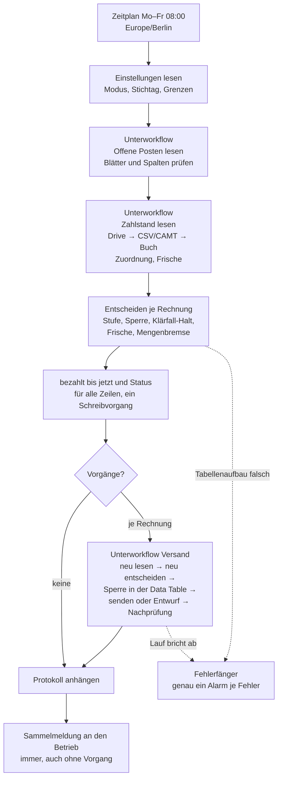

# Mahnlauf

**Status:** nicht aktiv · fünf Workflows, 129 Nodes · **getestet mit n8n 2.34.4** am 24. und 25.09.2026 (Testkatalog
Version 1 im Modus `test`, Schattenbetrieb im Modus `trocken`, ein Lauf im Modus `scharf`) · **Modus `scharf` ist im Export
gesperrt**, bewusst, siehe [Modi](#modi-trocken-test-scharf). Alle Daten in diesem Ordner sind erfunden: Betrieb
„Tischlerei Beispiel GmbH“, Kunden, Rechnungen, IBANs, Kontoauszüge.

## Problem und für wen

Viele kleine Betriebe schreiben ordentliche Rechnungen und fassen danach unregelmäßig oder gar nicht nach. Nicht aus
Nachlässigkeit, sondern weil der Abgleich lästig ist: Welche Rechnung ist wirklich offen, wer hat schon überwiesen, wer nur
einen Teil? Eine Mahnung an jemanden, der längst gezahlt hat, kostet mehr Vertrauen als eine zu spät verschickte.

Der Mahnlauf gleicht jeden Werktag die offenen Rechnungen mit dem letzten Kontoauszug ab und fasst stufenweise nach:
Zahlungserinnerung, 1. Mahnung, letzte Mahnung, danach Übergabe an den Betrieb. Die Erinnerung geht automatisch, Mahnungen erst
nach Freigabe, und unmittelbar vor jeder Mail wird der Zahlstand neu gelesen. Was er nicht sicher entscheiden kann — eine Zahlung
ohne Rechnungsnummer, eine Überzahlung, einen zu alten Kontoauszug —, meldet er, statt es zu entscheiden.

**Für wen er sich lohnt:** Handwerksbetriebe und kleine Dienstleister mit etwa 10 bis 150 Ausgangsrechnungen im Monat, deren
Rechnungsprogramm nicht selbst mahnt oder das Konto nicht selbst abgleicht. Voraussetzung: Die Bank liefert den Kontoauszug als
CSV oder CAMT.053, und jemand legt ihn regelmäßig in einen Drive-Ordner.

**Für wen nicht:** Betriebe mit sehr wenigen Rechnungen (dafür reicht ein Kalendereintrag), Vorkasse- und Barbetriebe, und
Betriebe, deren Rechnungsprogramm schon mahnt und den Bankabgleich macht — dort wäre der Mahnlauf eine zweite Buchführung.

## Ablauf



| Stufe | fällig, wenn | Standard | Wirkung |
|---|---|---|---|
| 1 Zahlungserinnerung | Fälligkeit + 7 Tage | automatisch | Mail an den Kunden |
| 2 1. Mahnung | Versand Stufe 1 + 14 Tage | Gmail-Entwurf | geht erst nach „Freigabe = ja“ im Blatt |
| 3 letzte Mahnung | Versand Stufe 2 + 14 Tage | Gmail-Entwurf | wie Stufe 2 |
| 4 Übergabe | Versand Stufe 3 + 14 Tage | nur Meldung | keine Mail an den Kunden, danach keine Automatik |

Höchstens eine Stufe je Rechnung und Lauf, keine wird übersprungen; eine Stufe gilt erst mit dem bestätigten Versand. Die
Rechnungs-PDF hängt auf Wunsch an (Link je Rechnung, höchstens 8 000 000 Byte).

**Die fünf Workflows:**

| Datei | Workflow | Aufgabe |
|---|---|---|
| `workflows/1-fehlerfaenger.json` | Mahnlauf – Fehlerfänger | `errorWorkflow` der anderen vier; Alarm per SMTP an die Meldeadresse |
| `workflows/2-offene-posten-lesen.json` | Mahnlauf – Offene Posten lesen | Blatt „Offene Posten“ lesen und prüfen, Vertrag `{quelle, stichtag}` |
| `workflows/3-zahlstand-lesen.json` | Mahnlauf – Zahlstand lesen | Kontoauszüge lesen, Buch „Zahlungseingänge“ fortschreiben, zuordnen |
| `workflows/4-versand.json` | Mahnlauf – Versand | eine Rechnung: neu entscheiden, sperren, senden oder Entwurf |
| `workflows/5-hauptlauf.json` | Mahnlauf – Hauptlauf | Zeitplan, Entscheidung, Mengenbremse, Protokoll, Sammelmeldung |

Die Logik steckt nicht in Ausdrücken, sondern in 14 JavaScript-Modulen unter [`kern/`](kern/). Die Code-Nodes tragen genau diese
Bytes (vor der Marke `// ==== Treiber, nicht Teil des Kerns …`), die Tests unter [`tests/`](tests/) prüfen dieselben Dateien.

## Sicherungen gegen falsche Mahnungen

Jede Sicherung steht im Kern an einer markierten Stelle (`// Sicherung …`). 26 davon wurden einzeln auskommentiert; jede
machte zwischen 1 und 10 Tests rot.

- **Frische des Kontoauszugs.** Ist der neueste lesbare Auszug älter als „Max. Alter“ (Standard 3 Tage, deckt Montag mit
  Freitagsauszug) oder fehlt er, geht **keine** Mail hinaus, auch keine Erinnerung — Alarm in der Sammelmeldung. Der Stand ist
  das Datum aus dem Inhalt, nie das Änderungsdatum der Datei.
- **Mengenbremse.** Würden mehr Mails fällig als „Höchstzahl Mails je Lauf“, wird nichts versendet. Das fängt den Fall, dass ein
  falsch gelesenes Datumsformat plötzlich alle Rechnungen überfällig macht.
- **Neu-Lesen vor jedem Versand.** Der Unterworkflow Versand liest Zeile, Buch, Textbausteine und Einstellungen frisch und
  entscheidet neu. Weicht das Ergebnis vom Plan am Laufbeginn ab — neue Zahlung, gesetzte Sperre —, wird nichts versendet.
- **Sperre gegen Doppelversand** in einer n8n Data Table (`mahnlauf-sperre`, legt der Hauptlauf selbst an): erst eine Zeile
  `reserviert` einfügen, dann lesen; nur die früheste Reservierung sendet. Die Reservierung eines abgebrochenen Laufs wird nie
  überschrieben: Der nächste Lauf sucht im Gesendet-Ordner und sendet nicht noch einmal.
- **Klärfall-Halt.** Eine Zahlung ohne Rechnungsnummer wird nie automatisch verbucht, auch wenn der Betrag genau passt. Jede
  Rechnung, die als Kandidat in Frage kommt, bekommt bis zur Klärung keine Mahnung — so wird niemand gemahnt, der ohne Nummer
  bezahlt hat.
- **Mahnsperre** (Spalte „Mahnsperre“) gewinnt immer, auch über einen freigegebenen Entwurf.
- **Freigabe verfällt,** wenn sich der Restbetrag seit dem Entwurf geändert hat: alter Entwurf gelöscht, neuer angelegt.
- **Feste Texte.** Jede Kundenmail kommt aus den Textbausteinen des Betriebs; jeder Platzhalter wird geprüft, ein unbekannter
  oder leerer sperrt die Mail. Jeder Betreff muss `{rechnungsnr}` tragen, sonst wird im ganzen Lauf nichts versendet. Kein
  Modell formuliert Text an Kunden.
- **Fail-closed beim Tabellenaufbau:** fehlt ein Blatt oder eine Spalte, bricht der Lauf vor jedem Versand ab und alarmiert.

## Modi: trocken, test, scharf

| Modus | Kundenmails | Sammelmeldung und Alarm | Blatt |
|---|---|---|---|
| `trocken` (Vorlage) | keine; die Sammelmeldung listet, was versendet worden wäre, Betreff mit „[TROCKEN – nichts versendet]“ | an die Meldeadresse | nur das Protokoll wird geschrieben |
| `test` | jede an den **Testempfänger**, im Code erzwungen; der „Stichtag (nur Test)“ ersetzt „heute“ | an die Meldeadresse | wie scharf |
| `scharf` | an die Kundenadresse der Zeile | an die Meldeadresse | wie beschrieben |

**Schattenbetrieb:** Vor dem Scharfschalten läuft der Mahnlauf einige Wochen im Modus `trocken` beim Betrieb mit. Jeden Morgen
kommt die Sammelmeldung mit der Liste dessen, was er versendet hätte; der Betrieb vergleicht sie mit seinem eigenen Stand.

**Modus `scharf` ist im Export gesperrt.** Der Knoten „Einstellungen prüfen“ im Hauptlauf wirft bei `scharf` mit „Modus scharf
ist in dieser Fassung gesperrt – vor dem Scharfschalten Schattenbetrieb im Modus trocken, dann diese Zeile entfernen“. Das ist
eine bewusste Grenze: Wer den Workflow importiert, entfernt diese eine Zeile erst nach dem Schattenbetrieb. Gemessen ist `scharf`
trotzdem: am 25.09.2026 ein regulärer Lauf aus dem Zeitplan mit entfernter Sperrzeile, vier Kundenmails an Plus-Adressen einer
Testadresse (To-Kopf jeder Mail gleich der E-Mail ihrer Zeile, keine an eine andere Adresse), eine Sammelmeldung an die
Meldeadresse, danach wieder gesperrt.

## Einrichtung

1. **n8n 2.34.4.** Die Fehlerausgänge sind für genau diese Version gemessen (siehe unten); eine andere Version verlangt die
   Messung neu.
2. **Credentials** anlegen: Google Sheets OAuth2, Google Drive OAuth2, Gmail OAuth2 (das Konto, von dem die Kundenmails
   gehen) und SMTP (für Sammelmeldung und Alarm — über einen anderen Weg als Gmail, damit ein Gmail-Ausfall gemeldet wird).
3. **Tabelle:** [`vorlage/mahnlauf-vorlage.xlsx`](vorlage/mahnlauf-vorlage.xlsx) in Google Sheets importieren, Zeitzone
   „Europe/Berlin“ und Gebietsschema Deutschland einstellen. Blätter und Spaltennamen nicht ändern — der Workflow prüft sie.
4. **Einstellungen** ausfüllen (Blatt „Einstellungen“, Spalte B). Die Vorlage hat nur „Modus = trocken“; bewährte Werte:
   Intervalle 7/14/14/14, Zahlungsfrist 10, Freigabemodus `automatisch`/`Entwurf`/`Entwurf`/`Meldung`, Max. Alter 3,
   Rechnungsnummer-Muster `RE-\d{4}-\d{3,5}`, Mindestbetrag 5,00, Höchstzahl 20, Quelle `Sheet`, PDF anhängen `ja` oder `nein`.
   Dazu Absendername, Absenderadresse (das Gmail-Konto oder ein Alias dort), Meldeadresse, Firmenname, IBAN, Signatur, und die
   CSV-Zuordnung der eigenen Bank (Trennzeichen, Zeichensatz, Kopfzeile, Spaltennamen). [`beispiele/`](beispiele/) zeigt einen
   CSV-Auszug mit Vorspann und Soll/Haben-Spalte und CAMT.053 in `.001.02` und `.001.08`; die zweite CSV-Form, die der Parser
   kennt (ohne Vorspann, Betrag mit Vorzeichen), liegt unter [`tests/testdaten/csv/`](tests/testdaten/csv/).
5. **Textbausteine** schreiben: je Stufe 1–3 und Kundentyp B2B/B2C ein Betreff und ein Text. Platzhalter: `{kunde}`,
   `{rechnungsnr}`, `{rechnungsdatum}`, `{betrag}`, `{bezahlt}`, `{rest}`, `{frist_datum}`, `{firma}`, `{iban}`, `{signatur}`.
   Beispieltexte stehen in [`tests/testdaten/tabelle/testbetrieb.json`](tests/testdaten/tabelle/testbetrieb.json).
6. **Drive-Ordner** für die Kontoauszüge anlegen, seine ID in „Kontoauszug-Ordner“ eintragen.
7. **Importieren in dieser Reihenfolge:** `1-fehlerfaenger`, `2-offene-posten-lesen`, `3-zahlstand-lesen`, `4-versand`,
   `5-hauptlauf` (*Workflows → Import from File*). Danach in jedem Knoten die Credentials neu zuordnen — die IDs sind entfernt.
8. **Verweise setzen.** Die Workflow-IDs im Export gehören zu meiner Instanz; nach dem Import hat jeder Workflow eine neue.
   - In den Workflows 2 bis 5 unter *Settings → Error workflow* „Mahnlauf – Fehlerfänger“ wählen.
   - Im Hauptlauf die Knoten „Offene Posten lesen“, „Zahlstand lesen“ und „Versand“ auf die importierten Workflows stellen.
   - Die Tabellen-ID an **zwei** Stellen eintragen, wo `<GOOGLE_ID>` steht: Knoten „Lauf vorbereiten“ im Hauptlauf und Knoten
     „Fehler lesen“ im Fehlerfänger.
9. **Veröffentlichen:** zuerst Fehlerfänger und die drei Unterworkflows, zuletzt den Hauptlauf. n8n 2.34.4 startet einen
   Fehler-Workflow nur veröffentlicht; die Unterworkflows liefen in allen Tests veröffentlicht.
10. **Schattenbetrieb** im Modus `trocken`, dann `test` mit der eigenen Adresse als Testempfänger, erst dann die Sperrzeile
    entfernen und `scharf`.

**Optional: Healthchecks.** Der Mahnlauf meldet jeden Lauf per Sammelmeldung — aber wenn er gar nicht läuft (Instanz aus,
Workflow inaktiv), meldet niemand etwas. Wer das absichern will, hängt ans Ende des Hauptlaufs einen `httpRequest` auf eine
Healthchecks-Ping-URL (Never Error) und lässt Healthchecks alarmieren, wenn der Ping ausbleibt. Nicht Teil von Version 1.

## Im Betrieb

- **Freigabe:** Für eine wartende 1. oder letzte Mahnung setzt der Betrieb in „Offene Posten“ die Spalte „Freigabe“ auf `ja`.
  Der nächste Lauf prüft alles neu und schickt den Entwurf ab — so, wie er im Postfach steht, also auch mit Änderungen des
  Betriebs. Ein von Hand in Gmail gesendeter Entwurf wird erkannt und die Stufe mit dem Versanddatum nachgezogen.
- **Klärfälle** klärt der Betrieb im Blatt „Zahlungseingänge“, Spalte „manuelle Zuordnung“; der nächste Lauf verbucht sie.
- **„Versandstatus unklar“** entsteht, wenn ein Lauf mitten im Versand abbrach und die Mail auch im Gesendet-Ordner nicht zu
  finden ist. Der Mahnlauf sendet dann nie von selbst noch einmal. Der Betrieb prüft sein Postfach und trägt in „Offene
  Posten“, Spalte „Versandstatus klären“, `versendet` oder `nicht versendet` ein. Bei `versendet` zieht der nächste Lauf Stufe
  und Datum nach (Datum = Tag dieses Laufs, die Tabelle kennt kein Bearbeitungsdatum je Zelle); bei `nicht versendet` gibt er
  die Reservierung frei, und der Lauf danach entscheidet normal. In beiden Fällen leert er die Zelle und nennt die Klärung in der
  Sammelmeldung. Ein Wert ohne offene Reservierung ändert nichts, die Zeile wird dann nicht versendet und gemeldet.
- **Belastungen** (Lastschriften, Abbuchungen) zählen nicht und stehen nur im Protokoll. Storno und Rücklastschrift werden
  Klärfall.
- **Verarbeitete Auszüge dürfen archiviert werden.** Jede Buchung steht nach dem ersten Lauf im Blatt „Zahlungseingänge“ und
  zählt über ihren Buchungsschlüssel genau einmal. Im Ordner muss nur der jüngste Auszug bleiben, denn sein Stand ist die
  Frische.

## Quellen: Sheet und sevDesk

Der Hauptlauf kennt die Quelle nicht. Er ruft „Offene Posten lesen“ mit `{quelle, stichtag}` und „Zahlstand lesen“ mit
`{quelle, stichtag, posten, schreiben}`; welche Quelle dahinter steckt, bestimmt die Einstellung „Quelle“.

- **Sheet** — gebaut und getestet: offene Rechnungen im Blatt, Zahlstand aus den Kontoauszügen.
- **sevDesk** — vorbereitet, **nicht gebaut, nicht getestet.** Heute ergibt `Quelle = sevDesk` den Status
  `quelle_nicht_gebaut`, und es wird nichts gelesen. Gebaut kämen Rechnungen und Zahlstand aus dem Bankabgleich von sevDesk;
  Kontoauszug, Parser und Klärfälle entfielen. Vor dem Bau zu messen: API im Tarif, Felder für Brutto, gezahlt, Fälligkeit und
  Status, Herkunft der Kunden-E-Mail, und ob sevDesk selbst mahnt. Der Zustand des Mahnlaufs bliebe im Sheet; er schreibt nie
  nach sevDesk.

## Was er nicht tut

Kein Inkasso, kein gerichtliches Mahnverfahren, keine Mahngebühren, keine Verzugszinsen und keine Pauschale (Version 2), keine
Buchung in der Finanzbuchhaltung, keine Ratenvereinbarung, keine Bankanbindung (der Kontoauszug kommt als Datei), keine frei
formulierten Texte an Kunden, keine automatische Verbuchung einer unklaren Zahlung.

## Gemessen, nicht angenommen

Jeder dieser Punkte hat den Bau verändert. Gemessen auf n8n 2.34.4 an einer Kopie der Workflows, mit Laufnummern in meinen
Arbeitsbelegen.

- **Google Sheets verliert beim gleichzeitigen Anhängen Zeilen.** Zwei Unterläufe, 11–218 ms nacheinander, hängen je eine
  Zeile an dasselbe Blatt: Mit dem Standard-Anhängen des Sheets-Knotens ging in 10 von 10 Runden eine Zeile verloren, mit
  `useAppend` in 3 von 10. Die Sheets-API mit `INSERT_ROWS` verlor keine, verschob aber Zeilen nachträglich — ein Lauf, der
  zwischen zwei Einfügungen liest, hält sich für den ersten. **Deshalb liegt die Sperre in einer n8n Data Table** (10 von 10,
  `id` aufsteigend, beide Läufe einig). Das Blatt „Protokoll“ ist nur zum Lesen da.
- **Der `xml`-Knoten 1 verschluckt ein Item, wenn er `onError` trägt:** Die kaputte Datei landet weder auf Ausgang 0 noch 1,
  und der Lauf meldet `success`. Er läuft deshalb ohne `onError`; ein Code-Knoten davor prüft das XML und nennt im Fehler den
  Dateinamen, den der `xml`-Knoten nicht nennt.
- **Der `errorWorkflow` feuert auch für einen Unterlauf, dessen Fehler der Aufrufer abfängt.** Ein Wurf im Unterworkflow ist
  also immer ein Alarm. Unterworkflows werfen deshalb nur bei Unerwartetem und geben sonst einen Status zurück. Der Fehler des
  Aufrufers trägt die Laufnummer des Unterlaufs — daran erkennt der Fehlerfänger, dass schon gemeldet wurde, und schickt genau
  einen Alarm je Fehler.
- **Sheets-Zahlenformat:** Gelesen wird mit `UNFORMATTED_VALUE` und `SERIAL_NUMBER` — ein Datum kommt als Seriennummer, ein
  Betrag als Zahl, ein getipptes Text-Datum ist damit als ungültig erkennbar. Geschrieben wird `RAW`; eine leere Zeichenkette
  mit `RAW` entfernt dabei das Zahlenformat der Zelle, mit `USER_ENTERED` bleibt es.
- **`httpRequest` 4.5 bedient seinen Fehlerausgang nicht** (das Item liegt auf Ausgang 0). Alle 25 HTTP-Knoten laufen deshalb
  mit „Never Error“ und voller Antwort, der Folgeknoten prüft den Statuscode. `onError` tragen nur `emailSend` 2.1 und
  `googleDrive` 3 — beide gemessen bedient.
- **Der Gmail-Knoten 2.2 setzt den Absendernamen ohne Anführungszeichen:** Aus „Tischlerei Beispiel GmbH (Test)“ wurde im
  Gesendet-Ordner „Tischlerei Beispiel GmbH“, der Klammerteil galt als Kommentar. Einen Entwurf senden kann der Knoten nicht.
  Die Kundenmail ist deshalb eine eigene MIME-Nachricht (`kern/mime.js`, RFC 2047 für Umlaute), gesendet per `messages.send`
  bzw. `drafts.send`.
- **PDF-Anhang:** `messages.send` nahm PDFs mit 3, 5, 7 und 10 MB an (JSON-Rumpf bis 18 246 474 Byte); eine Obergrenze war bis
  10 MB nicht zu finden. Die Grenze im Versand liegt mit Abstand bei 8 000 000 Byte.
- **`n8n execute` (CLI) lädt das Data-Table-Modul nicht** und startet keinen Workflow, dessen einziger Trigger ein Zeitplan
  ist. Alles mit Sperre wurde deshalb in kurzen Veröffentlichungsfenstern über Zeitplan- oder Aufruf-Trigger getestet.

## Testabdeckung

- **Kernlogik:** 225 Tests, ohne Abhängigkeiten, ohne npm:

  ```bash
  cd workflows/mahnlauf && node --test        # Node 20 oder neuer; gemessen mit Node 24
  ```

  Dazu 26 Sicherungen, jede einzeln auskommentiert (Mutation): jede macht 1 bis 10 Tests rot.
- **In n8n, Testkatalog Version 1 — 17 Fälle** im Modus `test` mit eigener Test-Tabelle, Test-Postfach und Test-Kontoauszügen:
  pünktlich bezahlt, Teilzahlung, Überzahlung, Zahlung ohne Rechnungsnummer, zwei gleiche Beträge, Mahnsperre, Auszug zu alt,
  doppelter Lauf (nacheinander und binnen 33 ms gleichzeitig: genau eine Mail), Zahlung zwischen Entwurf und Versand, kaputte
  CSV, leeres und falsch aufgebautes Blatt, CAMT-Sammelbuchung, ganze Stufenfolge über reguläre Läufe aus dem Zeitplan,
  unbekannter Platzhalter, von Hand gesendeter Entwurf, Mengenbremse, erzwungener Testempfänger. Jede Vorhersage stand vor dem
  Lauf fest; getroffen wurden 325 von 332 verglichenen Größen (die übrigen: ein Simulator, der zwei gleichzeitige Läufe
  nacheinander rechnete, und zwei Textdetails).
- **Danach** die letzten Änderungen (Meldungen an die Meldeadresse, Belastungen ins Protokoll, „Versandstatus klären“) in einem
  eigenen Fenster: 7 Mails, jede wie vorhergesagt. Und der eine Lauf im Modus `scharf` (siehe Modi).
- Nicht in n8n gemessen, nur im Kern getestet: PDF-Laden scheitert nach der Sperre, HTTP 4xx/5xx beim Senden, Alarm an die
  Absenderadresse bei ungültiger Meldeadresse.

## Grenzen und Ausblick

- **Version 2:** Verzugsbeginn, Verzugszinsen und die 40-€-Pauschale (B2B) mit einer Basiszins-Tabelle im Einstellungsblatt und
  Alarm, wenn sie veraltet ist; die Spalte „Verzugshinweis auf Rechnung“ ist dafür schon da. Kandidat: ein KI-Vorschlag für
  Klärfälle, nur in der internen Meldung, nie verbuchend.
- Zwei vollkommen gleiche Buchungen am selben Tag in unterschiedlich geschnittenen CSV-Dateien kann nur eine Bankreferenz
  trennen.
- Kein Healthchecks-Ping (siehe Einrichtung).
- Kundennamen, Adressen und Beträge liegen in Google Sheets, Drive und Gmail; dafür braucht der Betrieb einen
  Auftragsverarbeitungsvertrag mit Google.

## Keine Rechtsberatung

Der Mahnlauf versendet feste Texte nach festen Fristen. Auch eine Zahlungserinnerung kann rechtliche Wirkung haben. Welche
Fristen, Texte und Stufen im eigenen Betrieb richtig sind, gehört vor dem Einsatz mit einer Rechtsberatung geklärt. Diese
Beschreibung ist Arbeitsstand, nicht anwaltlich geprüft.

## Dateien

```
workflows/   die fünf Workflows, bereinigt (Credential-IDs, Tabellen-ID entfernt), Importreihenfolge 1 bis 5
kern/        14 Module, byte-gleich mit den Code-Nodes
tests/       225 Tests (node --test) und erfundene Testdaten: Kontoauszüge CSV und CAMT, Test-Tabelle
vorlage/     leere Tabellenvorlage, Modus trocken
beispiele/   ein CSV-Auszug mit Vorspann und Soll/Haben-Spalte, CAMT.053 .001.02 und .001.08
```
