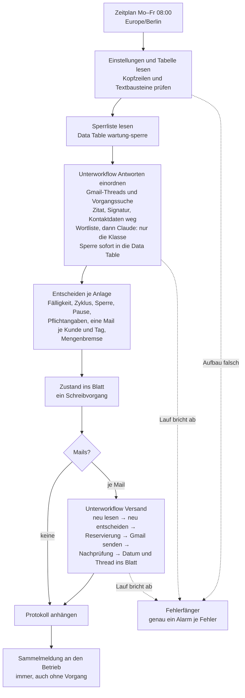

# Wartungserinnerung

**Status:** nicht aktiv · vier Workflows, 93 Nodes · **getestet mit n8n 2.34.4** am 26. und 27.09.2026 (Modus `trocken`,
dann Testkatalog W01–W29 im Modus `test` in drei Veröffentlichungsfenstern) · **Modus `scharf` ist im Export gesperrt**,
bewusst, siehe [Modi](#modi-trocken-test-scharf). Alle Daten in diesem Ordner sind erfunden: Betrieb „Heizung & Sanitär
Beispiel GmbH“, Kunden „Kunde Beispiel NN“, Adressen `kunde-NN@example.invalid`, Anlagen `W-9NNN`.

## Problem und für wen

Heizungen, Wärmepumpen und Lüftungsanlagen brauchen regelmäßig Wartung, und die meisten Kunden wissen nicht mehr, wann die
letzte war. Viele kleine Betriebe erinnern deshalb per Brief, per Zuruf oder gar nicht — der Kunde ruft erst an, wenn die
Anlage ausfällt. Eine automatische Werbemail an Bestandskunden ist schnell gebaut; schwer ist, dabei nichts falsch zu machen:
wer widersprochen hat, darf nie wieder eine bekommen, auch nicht über eine zweite Anlage oder eine neue Kundennummer.

Die Wartungserinnerung rechnet jeden Werktag aus einer Google-Tabelle die nächste Fälligkeit je Anlage und schreibt dem Kunden
rechtzeitig davor ein Wartungsangebot aus festen Textbausteinen des Betriebs. Kommt keine Antwort, folgt **genau eine**
Erinnerung. Antworten liest sie im Gmail-Thread und lässt sie von Claude **einordnen** — Termin gewünscht, Rückfrage, kein
Interesse, Widerspruch. Ein Widerspruch sperrt den Kunden sofort und dauerhaft; alles andere kommt als Aufgabe in die tägliche
Sammelmeldung an den Betrieb. **Die KI schreibt nie an den Kunden.**

**Für wen sie sich lohnt:** SHK-Betriebe und andere Handwerker mit wiederkehrender Wartung (Heizung, Wärmepumpe, Lüftung,
Enthärtung), etwa 50 bis 1 500 Anlagen im Bestand, deren Branchenprogramm nicht selbst erinnert.

**Für wen nicht:** Betriebe mit Wartungsvertrag und festen Terminen (dort gibt es nichts anzubieten), Betriebe, deren Software
schon erinnert, und Neukundenwerbung — die Mail stützt sich auf § 7 Abs. 3 UWG und gilt nur für Bestandskunden.

## Ablauf



| Mail | wann (Standard) | Bedingung |
|---|---|---|
| Angebot | ab 42 Tage vor der Fälligkeit, bis 30 Tage danach | keine Sperre, keine Pause, Pflichtangaben vollständig, im Zyklus noch kein Angebot |
| Erinnerung | 14 Tage nach dem Angebot | keine Antwort; genau eine je Zyklus, im selben Gmail-Thread |
| — | 21 Tage nach der Erinnerung | „ohne Antwort abgeschlossen“; ein neues Angebot erst nach einem neuen Wartungsdatum |

**Fälligkeit** = letzte Wartung (sonst Einbaudatum) plus Intervall in Kalendermonaten, Monatsende-Regel (31.01. + 1 Monat =
28.02.). Trägt der Betrieb nach dem Termin die neue „letzte Wartung“ ein, beginnt ein neuer Zyklus von selbst. Höchstens **eine
Mail je Kunde und Kalendertag** (Europe/Berlin): Eine zweite fällige Anlage desselben Kunden kommt am nächsten Werktag dran,
auch wenn am selben Tag ein zweiter Lauf startet.

**Die vier Workflows:**

| Datei | Workflow | Aufgabe |
|---|---|---|
| `workflows/1-fehlerfaenger.json` | Wartungserinnerung – Fehlerfänger | `errorWorkflow` der anderen drei; Alarm per SMTP an die Meldeadresse |
| `workflows/2-antworten-einordnen.json` | Wartungserinnerung – Antworten einordnen | Threads lesen, Antworten kürzen, Wortliste, Claude, Sperrzeilen |
| `workflows/3-versand.json` | Wartungserinnerung – Versand | eine Mail: neu entscheiden, reservieren, senden, nachprüfen |
| `workflows/4-hauptlauf.json` | Wartungserinnerung – Hauptlauf | Zeitplan, Entscheidung, Mengenbremse, Protokoll, Sammelmeldung |

Die Logik steckt nicht in Ausdrücken, sondern in zehn JavaScript-Modulen unter [`kern/`](kern/). Die Code-Nodes tragen genau
diese Bytes (vor der Marke `// ==== Treiber, nicht Teil des Kerns …`), die Tests unter [`tests/`](tests/) prüfen dieselben
Dateien. Blöcke, die aus dem [Mahnlauf](../mahnlauf/) stammen, tragen einen Herkunftsvermerk und sind byte-gleich übernommen.

## Die KI hat eine enge Aufgabe

- **Nur Einordnung.** Claude bekommt den gekürzten Antworttext und gibt genau drei Felder zurück: `kategorie` (`termin`,
  `rueckfrage`, `kein_interesse`, `widerspruch`), `sicher`, `widerspruch_moeglich`. Kein freies Textfeld.
- **Strukturierte Ausgabe** über Structured Outputs (`output_config.format`, JSON-Schema). Gemessen am 26.09.2026: mit Schema
  kam genau ein Textblock im Schema; ohne Schema kamen ein Codezaun, ein anderer Feldname und ein Zusatzfeld — eine Prüfung im
  Code wäre so nicht haltbar gewesen. Eine Antwort außerhalb des Schemas zählt als „keine Einordnung“.
- **Feste Modell-ID** `claude-haiku-4-5-20251001`, nicht der Alias `claude-haiku-4-5`. Alle Tests und Messungen gelten für genau
  diese Fassung; ein Alias könnte ohne Zutun auf eine neue zeigen, die anders einordnet. Ein Wechsel ist eine Änderung an einer
  Stelle (`KI_MODELL` in `kern/widerspruch.js`) mit neuem Testlauf.
- **Schreibt nie an Kunden.** Die Ausgabe fließt nur in einen Code-Node, der daraus eine feste Klasse macht; kein Pfad führt von
  der Anthropic-Antwort in eine Mail. Angebot und Erinnerung sind feste Textbausteine des Betriebs.
- **Kosten:** gemessen 418 Token Eingabe und 29 Token Ausgabe für eine typische Antwort, zu 1 $ / 5 $ je Million Token rund
  0,06 Cent je Einordnung.

| Ergebnis | Wirkung |
|---|---|
| `termin`, `rueckfrage`, `kein_interesse` (sicher) | Aufgabe in der Sammelmeldung („Termin gewünscht – Kunde anrufen …“, „Rückfrage – beantworten“, „kein Interesse – zur Kenntnis“); keine weitere Mail im Zyklus |
| Widerspruch, Widerspruchsverdacht, Wortlistentreffer, Einordnung fehlt | **gesperrt**, Kunde und Adresse, dauerhaft; Aufgabe „dem Kunden den Widerspruch schriftlich bestätigen“ |
| unsicher nur zwischen termin, rückfrage, kein Interesse | **zurückgestellt**: Aufgabe „bitte lesen“, keine automatische Mail an diesen Kunden bis „Antwort erledigt = ja“ |
| Abwesenheitsnotiz | zählt nicht als Antwort; die Erinnerung geht |
| Unzustellbar | keine Erinnerung, Hinweis „Adresse prüfen“ |
| Antwort auf eine Mail eines früheren Zyklus (bis 180 Tage) | zählt nur als Widerspruch; alles andere wird ignoriert |

## Sicherungen

Jede Sicherung steht im Kern an einer markierten Stelle (`// Sicherung …`). 53 davon wurden einzeln auskommentiert; jede machte
mindestens einen Test rot.

- **Wortliste vor der KI.** „widersprechen“, „keine Werbung/Mails“, „abmelden“, „abbestellen“, „austragen“, „nicht mehr
  schreiben“, „Daten löschen“ und ähnliche — im Text **oder im Betreff** — sperren ohne Anthropic-Aufruf. So hängt die Sperre
  nicht an der Erreichbarkeit der API. Der eigene Widerspruchshinweis im Zitat zählt nicht.
- **Im Zweifel am Widerspruch sperren.** Gesperrt wird bei Klasse `widerspruch`, bei `widerspruch_moeglich`, bei leerem Text und
  wenn die Einordnung fehlt (HTTP-Fehler, Schema verletzt) — dann zusätzlich Alarm. Ein Fehler in diese Richtung kostet eine
  Werbemail, in die andere einen Rechtsverstoß.
- **Zurückgestellt statt gesperrt** bei sonstiger Unsicherheit: „Nächstes Jahr gern wieder.“ ordnete Claude dreimal als
  `kein_interesse`, unsicher, ohne Verdacht ein — der Kunde bekommt keine Mail, bis der Betrieb die Antwort gelesen hat, aber
  auch keine dauerhafte Sperre.
- **Sperre nach Kunden-ID und E-Mail** in einer n8n Data Table (`wartung-sperre`, legt der Hauptlauf selbst an). Sie überlebt
  das Leeren der Zelle „Werbewiderspruch“ (die Zelle wird neu gesetzt und gemeldet), sperrt alle Anlagen des Kunden und eine
  neue Kunden-ID mit derselben Adresse. Der Workflow hebt nie selbst eine Sperre auf.
- **Widerspruchshinweis in jeder Mail.** Jeder Text muss `{widerspruch}` genau einmal tragen; den Absatz setzt der Code, nicht
  der Betrieb. Fehlt er in einem Textbaustein, geht im ganzen Lauf nichts hinaus (Alarm). Dazu trägt jede Mail
  `List-Unsubscribe` (mailto an „Antwort an“, Betreff „Abmelden <Vorgang>“); eine solche Abmeldung findet der Workflow über den
  Vorgang im Betreff und sperrt über die Wortliste.
- **Pflichtangaben nach § 7 Abs. 3 UWG im Datenmodell:** ohne „Leistung des Betriebs“, „Adresse erhoben bei“ und
  „Widerspruchshinweis bei Erhebung“ keine Mail an diese Anlage.
- **Eine Mail je Kunde und Tag**, gelesen aus der Data Table — auch über zwei Läufe am selben Tag.
- **Offene Antwort hält an.** Solange eine Antwort des Kunden nicht als erledigt markiert ist, bekommt er keine automatische
  Mail, auch nicht zu einer anderen Anlage.
- **Mengenbremse.** Würden mehr Mails fällig als „Höchstzahl Mails je Lauf“, geht keine hinaus (Alarm). Das fängt den ersten
  Lauf nach dem Import eines Altbestands und ein falsch gelesenes Datumsformat.
- **Sperre gegen Doppelversand** (wie im Mahnlauf): Reservierung in der Data Table, nur die früheste sendet, `versendet`
  gewinnt; Zeile und Sperrliste werden unmittelbar vor jeder Mail neu gelesen und neu entschieden. Die Reservierung eines
  abgebrochenen Laufs wird nie neu gesendet: Der Workflow sucht im Gesendet-Ordner über den Vorgang; gefunden → nachgezogen,
  sonst `versand_unklar` und Alarm.
- **Lesen ist Voraussetzung für Senden.** Findet die Vorgangssuche keinen einzigen gespeicherten Thread wieder oder scheitert
  ein Thread-Abruf, geht in diesem Lauf nichts hinaus — eine übersehene Antwort könnte ein Widerspruch sein.
- **Datensparsamkeit:** An Anthropic geht nur der gekürzte Antworttext: ohne zitierten Verlauf, ohne Signatur, Telefonnummern,
  Mailadressen, Anschriften und IBANs als Platzhalter, höchstens 2 000 Zeichen; kein Name, keine Kunden-ID. Der Text wird
  nirgends gespeichert — nicht im Blatt, nicht in der Data Table, nicht im Protokoll, nicht in der Sammelmeldung.
  **Nachweis mit einer echten Antwort** (27.09.2026): Eine Antwort aus Gmail auf die Erinnerung trug 22 Zeilen, davon 16
  Zitatzeilen und einen Zitatkopf, darin der ganze Erinnerungstext samt Widerspruchsabsatz. An Anthropic ging genau
  `Gern, bitte rufen Sie mich nächste Woche vormittags an.` — eingeordnet `termin`, sicher.
- **Fail-closed beim Tabellenaufbau:** fehlt ein Blatt oder eine Spalte oder ist sie umbenannt, bricht der Lauf vor jedem
  Schreiben ab und alarmiert.

## Zustellbarkeit

Gemessen am 27.09.2026 in einem Gmail-Testpostfach, gelesen nur über die Gmail-API (`labelIds`), nichts verschoben oder
markiert.

- Die **erste** Testmail (26.09., reiner Text, Betreff mit „(Beispiel, ZZ Test)“, neuer Absendername, ohne
  `List-Unsubscribe`) lag im **Spam**, obwohl SPF, DKIM und DMARC bestanden. Mails des Mahnlaufs vom selben Absender lagen im
  Posteingang; die Köpfe beider Arten sind bis auf `Content-Transfer-Encoding` gleich, keine enthält Links oder Bilder.
- Nachdem der Empfänger sie als „kein Spam“ markiert hatte, landeten fünf Varianten im **Posteingang** (gelesen nach 0,5, 6 und
  19 Minuten): A wie zuvor; B mit `List-Unsubscribe`; C Betreff ohne „Test/Beispiel/ZZ“; D Text und HTML; E alles zusammen.
- Danach alle **21 Kundenmails** der Testläufe (6 am Vormittag, 15 im Testkatalog) im Posteingang, keine im Spam, je SPF, DKIM
  und DMARC `pass`, DKIM-Domain gleich Absenderdomain.
- **Offener Befund:** Welche Eigenschaft die erste Mail in den Spam brachte, ist **nicht** geklärt. Das sind Einzelmessungen an
  einem Postfach, und Gmail lernt aus der Markierung „kein Spam“.
- **Abmeldung per Klick ungemessen:** Gmail zeigte beim Testempfänger keinen „Abbestellen“-Link — erwartbar bei einem neuen
  Absender mit wenig Volumen. `List-Unsubscribe` (mailto) bleibt drin; nachgebildet ist gemessen, dass eine Mail „Abmelden
  <Vorgang>“ an „Antwort an“ den Kunden sperrt.

Übernommen: `List-Unsubscribe` mailto. HTML nicht — gemessen ohne Unterschied.

**Rat an Betriebe:**

- Eine **eigene Domain** mit SPF, DKIM und DMARC, kein Freemail-Absender; der Absendername ist der Firmenname, den die Kunden
  kennen.
- **Langsam anfangen:** die ersten Tage wenige Mails („Höchstzahl Mails je Lauf“), dann steigern; einen Altbestand nicht an einem
  Tag anschreiben.
- **Sachlicher Text:** ein kurzer Hinweis auf die fällige Wartung, keine Werbesprache, keine Links oder Anhänge, die nicht
  gebraucht werden.
- Vor dem Start eine Testmail an eigene Adressen bei mehreren Anbietern schicken und nachsehen, wo sie landet.

## Rechtlicher Arbeitsstand — keine Rechtsberatung

Arbeitsstand, nicht anwaltlich geprüft. Vor dem Einsatz beim Kunden gehört er mit einer Rechtsberatung geklärt.

- **§ 7 Abs. 3 UWG.** Ein Wartungsangebot per E-Mail ist Werbung. Ohne ausdrückliche Einwilligung ist sie nur an Bestandskunden
  zulässig, wenn (1) die Adresse vom Kunden im Zusammenhang mit einer Leistung stammt — Spalte „Adresse erhoben bei“, (2) eine
  eigene ähnliche Leistung beworben wird — Spalte „Leistung des Betriebs“, das Angebot betrifft nur die Wartung dieser Anlage,
  (3) der Kunde nicht widersprochen hat — Sperre, und (4) er bei der Erhebung und bei **jeder** Verwendung klar auf sein
  jederzeitiges Widerspruchsrecht hingewiesen wird, ohne andere als Übermittlungskosten nach Basistarif — Spalte
  „Widerspruchshinweis bei Erhebung“ und der feste Absatz in jeder Mail.
- **Art. 21 DSGVO.** Widerspruch gegen Direktwerbung jederzeit, danach keine Verarbeitung mehr zu diesem Zweck; Hinweis
  verständlich und getrennt von anderen Informationen — eigener Absatz. Die Sperrliste (Kunden-ID, Adresse, Datum, Grund) dient
  dazu, den Widerspruch einzuhalten. Nach Art. 12 Abs. 3 DSGVO bestätigt der Betrieb dem Kunden den Widerspruch (Aufgabe in
  der Sammelmeldung).
- **Anthropic als Auftragsverarbeiter.** Der gekürzte Antworttext geht an Anthropic. **Vor dem Einsatz beim Kunden:**
  Auftragsverarbeitungsvertrag (Art. 28 DSGVO) mit Anthropic, Drittlandübermittlung (Art. 44 ff.) prüfen, Datenschutzhinweise
  des Betriebs um die Wartungserinnerung und die Einordnung mit KI ergänzen. Das Kürzen ist eine Heuristik und kann versagen.
  Kundennamen, Adressen und Antworten liegen außerdem in Google Sheets und Gmail — dafür braucht der Betrieb einen
  Auftragsverarbeitungsvertrag mit Google.
- **Art. 22 DSGVO:** Die einzige automatische Folge der Einordnung ist eine Sperre, also weniger Werbung; alle anderen Folgen
  entscheidet der Betrieb.

## Modi: trocken, test, scharf

| Modus | Kundenmails | Sammelmeldung und Alarm | Blatt |
|---|---|---|---|
| `trocken` (Vorlage) | keine; die Sammelmeldung listet, was versendet worden wäre, Betreff mit „[TROCKEN – nichts versendet]“ | an die Meldeadresse | nur das Protokoll wird geschrieben; die Sperrliste wird nicht gelesen |
| `test` | jede an den **Testempfänger**, im Code erzwungen; der „Stichtag (nur Test)“ ersetzt „heute“ | an die Meldeadresse | wie scharf |
| `scharf` | an die Adresse der Zeile | an die Meldeadresse | wie beschrieben |

**Schattenbetrieb:** Vor dem Scharfschalten läuft die Wartungserinnerung einige Wochen im Modus `trocken` beim Betrieb mit. Jeden
Morgen kommt die Sammelmeldung mit der Liste dessen, was sie versendet hätte; der Betrieb vergleicht sie mit seinem Bestand.
Danach `test` mit einer eigenen Adresse als Testempfänger — auch, um die Zustellbarkeit beim eigenen Anbieter zu sehen.

**Modus `scharf` ist im Export gesperrt.** Der Knoten „Einstellungen prüfen“ im Hauptlauf wirft bei `scharf` mit „Modus scharf
ist in dieser Fassung gesperrt – erst nach AVV und Freigabe (README)“. Wer den Workflow einsetzt, entfernt diese eine Zeile
(`if (true && e.kern.modus === 'scharf') …`) erst nach Schattenbetrieb, AVV und Freigabe durch den Betrieb. Im Unterschied zum
Mahnlauf ist `scharf` hier **nicht** gemessen.

## Einrichtung

1. **n8n 2.34.4.** Die Fehlerausgänge sind für genau diese Version gemessen; eine andere Version verlangt die Messung neu.
   Data Tables müssen verfügbar sein (in 2.34.4 Standard).
2. **Credentials** anlegen: Google Sheets OAuth2, Gmail OAuth2 (das Konto, von dem die Mails gehen und in dem die Antworten
   ankommen), Anthropic (API-Schlüssel) und SMTP (für Sammelmeldung und Alarm — über einen anderen Weg als Gmail, damit ein
   Gmail-Ausfall gemeldet wird).
3. **Tabelle:** [`vorlage/wartungserinnerung-vorlage.xlsx`](vorlage/wartungserinnerung-vorlage.xlsx) in Google Sheets
   importieren, Zeitzone „Europe/Berlin“ und Gebietsschema Deutschland einstellen. Blätter und Spaltennamen nicht ändern — der
   Workflow prüft sie.
4. **Einstellungen** ausfüllen (Blatt „Einstellungen“, Spalte B): Absendername, Absenderadresse (das Gmail-Konto oder ein Alias
   dort), **„Antwort an“ — muss im selben Gmail-Konto ankommen**, sonst sieht der Workflow keine Antwort, Meldeadresse,
   Firmenname, Telefon, Signatur. Die Fristen stehen auf bewährten Werten (Vorlauf 42, Nachlauf 30, Erinnerung nach 14,
   Antwortfenster 21, Antworten lesen bis 180 Tage, Standardintervall 12 Monate, Höchstzahl 20).
5. **Textbausteine** prüfen: je Art (Angebot, Erinnerung) ein Betreff und ein Text. Platzhalter `{kunde}`, `{anlage}`,
   `{faellig_monat}`, `{vorgang}`, `{firma}`, `{telefon}`, `{signatur}` und `{widerspruch}`. Jeder Betreff trägt `{vorgang}`,
   jeder Text `{widerspruch}` genau einmal.
6. **Anlagen** eintragen, je Anlage eine Zeile; die Spalten ab „nächste Fälligkeit“ schreibt nur der Workflow.
7. **Importieren in dieser Reihenfolge:** `1-fehlerfaenger`, `2-antworten-einordnen`, `3-versand`, `4-hauptlauf`. Je Datei einen
   neuen Workflow anlegen, oben rechts *⋯ (Actions) → Import from file…*; der Name kommt aus der Datei, gespeichert wird
   selbsttätig. Erst zum nächsten Workflow wechseln, wenn gespeichert ist.
8. **Credentials in den Knoten zuordnen.** Der Import setzt nur SMTP („Alarm senden“, „Sammelmeldung“); die übrigen 15 Knoten
   einmal öffnen (gibt es für den Typ genau eine Credential, setzt n8n sie selbst) oder im Feld wählen:
   - Fehlerfänger: „Einstellungen lesen“ (Sheets)
   - Antworten einordnen: „Suchen“, „Thread lesen“ (Gmail); „Claude fragen“ (Anthropic)
   - Versand: „Neu lesen“, „Zellen schreiben“ (Sheets); „Angebotsthread lesen“, „Senden“, „Nachprüfen“, „Gesendet suchen“,
     „Gesendet lesen“ (Gmail)
   - Hauptlauf: „Einstellungen lesen“, „Tabelle lesen“, „Zustand schreiben“, „Protokoll anhängen“ (Sheets)
9. **Tabellen-ID** an **zwei** Stellen eintragen, wo `<GOOGLE_ID>` steht: im Code-Node „Lauf vorbereiten“ des Hauptlaufs (im
   Code-Editor mit Strg+F bzw. Cmd+F suchen und ersetzen) und im Feld „URL“ des Knotens „Einstellungen lesen“ im Fehlerfänger.
10. **Einstellungen der Workflows.** Der Import übernimmt sie nicht. In allen vier unter *⋯ → Settings* „Timezone“ auf
    „Europe/Berlin“ — eine frische Instanz steht auf „America/New York“, und nach ihr richtet sich der Zeitplan. In „Antworten
    einordnen“ zusätzlich „Save successful production executions“ auf „Do not save“ — die Laufdaten dieses Workflows enthalten
    die Antworttexte der Kunden.
11. **Fehlerfänger veröffentlichen** (*Publish*; der vorgeschlagene Versionsname genügt), danach in den Workflows 2 bis 4 unter
    *Settings → Error Workflow* „Wartungserinnerung – Fehlerfänger“ wählen. Vorher ist er dort ausgegraut: n8n 2.34.4 bietet nur
    einen veröffentlichten Fehler-Workflow an und startet auch nur einen solchen.
12. **Unterworkflows verweisen.** Die Knoten „Antworten einordnen“ und „Versand“ im Hauptlauf tragen noch die Workflow-IDs
    meiner Instanz; der Editor zeigt dafür keine Warnung. Je Knoten bei *Workflow* von „By ID“ auf „From list“ umstellen und den
    importierten Workflow wählen.
13. **Veröffentlichen:** „Antworten einordnen“ und „Versand“, zuletzt den Hauptlauf — ab dann läuft sein Zeitplan (Mo–Fr 08:00).
14. **Schattenbetrieb** im Modus `trocken`, dann `test`; `scharf` erst nach AVV und Freigabe (siehe [Modi](#modi-trocken-test-scharf)).

Gemessen am 27.09.2026 auf einer leeren n8n 2.34.4: alle vier nach diesen Schritten importiert und veröffentlicht, ohne
Fehlermeldung; jeder Code-Node nach dem Import gleich der Datei. Ein Probeaufruf aus einem zusätzlichen Workflow erreichte beide
Unterworkflows über die neu gesetzten Verweise, und ihr Fehler startete den Fehlerfänger. Ohne verbundenes Google-Konto endet
jeder Lauf am ersten Google-Aufruf („Unable to sign without access token“); die Schritte 3 bis 6 sind deshalb dort nicht
gemessen.

**Optional: Healthchecks.** Die Sammelmeldung kommt nach jedem Lauf — aber wenn gar keiner läuft (Instanz aus, Workflow
inaktiv), meldet niemand etwas. Wer das absichern will, hängt ans Ende des Hauptlaufs einen `httpRequest` auf eine
Healthchecks-Ping-URL (Never Error). Nicht Teil von Version 1.

## Im Betrieb

- **Aufgaben** stehen in der Sammelmeldung mit Kunde, Anlage, Klasse und Link auf den Gmail-Thread — nie mit dem Antworttext.
  Nach dem Anruf setzt der Betrieb „Antwort erledigt“ auf `ja`; nach dem Termin trägt er „letzte Wartung“ ein.
- **Widerspruch per Telefon oder Brief:** „Werbewiderspruch“ auf `ja` setzen; der nächste Lauf übernimmt ihn in die Sperrliste
  (Grund „Betrieb“).
- **Widerspruch aufheben** (der Kunde möchte doch wieder Angebote): nur mit Grund in „Widerspruch aufheben“ (mindestens zehn
  Zeichen, z. B. „Kunde hat telefonisch um Angebote gebeten“). Der nächste Lauf trägt `aufgehoben` für Kunden-ID und Adresse
  ein, leert „Werbewiderspruch“ bei **allen** Anlagen dieses Kunden und dieser Adresse und nennt es in der Sammelmeldung.
- **Pause** (Anlage stillgelegt, Haus verkauft, Reklamation): „Pause = ja“ mit Grund; gewinnt immer.
- **„Versandstatus unklar“** entsteht, wenn ein Lauf mitten im Versand abbrach und die Mail auch im Gesendet-Ordner nicht zu
  finden ist. Der Workflow sendet dann nie von selbst noch einmal. Der Betrieb prüft sein Postfach und trägt in „Versandstatus
  klären“ `versendet` oder `nicht versendet` ein. Bei `versendet` zieht der nächste Lauf Datum und Status nach, bei `nicht
  versendet` gibt er die Reservierung frei, und der Lauf danach entscheidet neu. Ein Wert ohne offene Reservierung ändert nichts
  und wird gemeldet.

## Was sie nicht tut

Keine Terminvergabe, kein Kalender, keine Antwort an Kunden durch die KI, keine frei formulierten Texte, keine SMS, keine
Anrufe, keine Neukundenwerbung, keine Mail an Adressen ohne dokumentierte Kundenbeziehung, keine Rechnung. Sie löscht und
verschiebt keine Mails. Sie erkennt nur, was als Antwort im Gmail-Thread ankommt oder den Vorgang (z. B. `W-9001/2026-10`) im
Betreff trägt — eine neue Mail ohne Bezug, ein Anruf oder ein Brief erreichen sie nicht; dafür setzt der Betrieb
„Werbewiderspruch“ von Hand.

## Gemessen, nicht angenommen

Jeder dieser Punkte hat den Bau verändert. Gemessen auf n8n 2.34.4 an einer Kopie der Workflows, mit Laufnummern in meinen
Arbeitsbelegen.

- **Eine Erinnerung landet im Thread des Angebots,** auch mit anderem Betreff, wenn `threadId`, `In-Reply-To` und `References`
  gesetzt sind; eine Antwort darauf kommt dort an. Die Vorgangssuche (`subject:"<Vorgang>"`, mit Spam und Papierkorb) findet
  zusätzlich Mails, die in einem eigenen Thread ankommen, etwa eine Abmeldung über `List-Unsubscribe`.
- **Gmail kodiert den Text beim Versand um:** gesendet als `text/plain` base64 mit dem Widerspruchsabsatz in einer Zeile, beim
  Empfänger `quoted-printable` mit hartem Umbruch bei 70 Zeichen. Der Wortlaut ist gleich; wer den Absatz im empfangenen Text
  sucht, muss Zeilenumbrüche zulassen.
- **Zwei Hauptläufe zur selben Minute** (einer aus dem Zeitplan, einer als Unterlauf): 11 Mails, jede genau einmal; der jeweils
  andere Lauf meldete „übersprungen, anderer Lauf“ oder — über die Tagesgrenze — „nächster Werktag“.
- **Der `errorWorkflow` feuert auch für einen Unterlauf,** dessen Fehler der Aufrufer trägt. Der Fehler des Aufrufers nennt die
  Laufnummer des Unterlaufs; daran erkennt der Fehlerfänger, dass schon gemeldet wurde — gemessen: zwei Fänger-Läufe, genau ein
  Alarm.
- **`httpRequest` 4.5 bedient seinen Fehlerausgang nicht** (das Item liegt auf Ausgang 0). Alle Aufrufe an Gmail, Sheets und
  Anthropic laufen deshalb mit „Never Error“ und voller Antwort, der Folgeknoten prüft den Statuscode. Ein ungültiger
  Anthropic-Schlüssel (HTTP 401) sperrt die betroffene Antwort aus Zweifel und alarmiert.
- **`n8n execute` (CLI) lädt das Data-Table-Modul nicht** und startet keinen Workflow, dessen einziger Trigger ein Zeitplan ist.
  Alles mit Sperrliste wurde deshalb in kurzen Veröffentlichungsfenstern über Zeitplan-Trigger getestet (höchstens zehn
  Minuten, danach wieder inaktiv).
- **Gmail drosselt:** 40 gleichzeitige Aufrufe an die Gmail-API (ein Aufräumwerkzeug, nicht dieser Workflow) ergaben für 15
  HTTP 429. Der Workflow liest in den Tests bis zu 32 Threads je Lauf ohne 429; scheitert ein Abruf, geht in diesem Lauf nichts
  hinaus (siehe Sicherungen).

## Testabdeckung

- **Kernlogik:** 160 Tests, ohne Abhängigkeiten, ohne npm:

  ```bash
  cd workflows/wartungserinnerung && node --test        # Node 20 oder neuer; gemessen mit Node 24
  ```

  Dazu 53 Sicherungen, jede einzeln auskommentiert (Mutation): jede macht mindestens einen Test rot.
- **In n8n, Testkatalog W01–W29** im Modus `test` mit eigener Test-Tabelle (50 Anlagen), Testpostfach und erfundenen
  Testantworten im Thread, in drei Veröffentlichungsfenstern (je rund acht Minuten, zehn Hauptläufe): Angebot im Vorlauf,
  Basisdatum, genau eine Erinnerung, Antwort verhindert Erinnerung, drei Klassen, klarer Widerspruch, Wortliste ohne KI (kein
  Anthropic-Aufruf), Widerspruchsverdacht, Datensparsamkeit, API-Fehler (401), dauerhafte Sperre, Sperre je Kunde und Adresse,
  fehlende Pflichtangabe, Textbaustein ohne Widerspruchshinweis (kein Versand im ganzen Lauf), neuer Zyklus, zwei Läufe
  gleichzeitig, Mengenbremse, Testempfänger und Köpfe, echte Antwort mit Zitat, Abwesenheit und unzustellbar, Pause und
  verpasst, umbenannte Kopfzeile, ein Alarm je Fehler, Abmeldung, eine Mail je Kunde und Tag, später Widerspruch auf einen
  früheren Zyklus, Versandstatus klären, Gesendet-Suche, „schon versendet – nachgezogen“, Widerspruch aufheben. Jede Vorhersage
  stand vor dem Lauf fest (ein Simulator rechnet die Läufe mit dem echten Code vorab); alle zehn Hauptläufe trafen sie in
  Entscheidungen, Mails, Sperrzeilen, Alarmen und Meldungen. Nicht vorhergesagt war nur, wie sich die Mails auf zwei
  gleichzeitige Läufe verteilen. Die Vorhersage selbst fand einen Fehler, bevor er live auftrat („Widerspruch aufheben“ leerte
  nur die eigene Zeile); er ist behoben und live nachgemessen.
- **Nach jedem Umlenk-Rahmen** (ungültiger Schlüssel, kaputter Aufruf) ein regulärer Lauf über dieselbe Strecke mit echtem
  Anthropic-Aufruf.
- Nicht in n8n gemessen, nur im Kern oder nachgebildet: echte Unzustellbarkeits- und Abwesenheitsnachricht (nachgebildete
  Köpfe), HTTP 429/5xx von Anthropic, Zitatformen von Outlook und Apple Mail, Abmeldung per Klick, Modus `scharf`.

## Grenzen und Ausblick

- **Version 2:** Gmail-Abrufe in Stapeln (die Drosselung oben); Abmeldung per Klick nach RFC 8058 (braucht einen öffentlichen
  Endpunkt); Messung mit Outlook- und Apple-Mail-Antworten; Ursache der ersten Spamablage.
- Das Kürzen von Zitat und Signatur ist eine Heuristik; ungewöhnliche Formen können mehr Text an Anthropic geben als nötig.
- Im Modus `trocken` wird die Sperrliste nicht gelesen: die Vorschau kann Kunden zeigen, die im Betrieb gesperrt sind.
- Eine Reservierung, die als `versand_unklar` endet, zählt für diesen Tag als „heute schon eine Mail“ — der Kunde bekommt dann
  auch zu einer anderen Anlage erst am nächsten Werktag Post.
- Kein Healthchecks-Ping (siehe Einrichtung).

## Dateien

```
workflows/   die vier Workflows, bereinigt (Credential-IDs, Tabellen-ID entfernt), Importreihenfolge 1 bis 4
kern/        zehn Module, byte-gleich mit den Code-Nodes
tests/       160 Tests (node --test), alle Werte erfunden
vorlage/     leere Tabellenvorlage, Modus trocken
```
